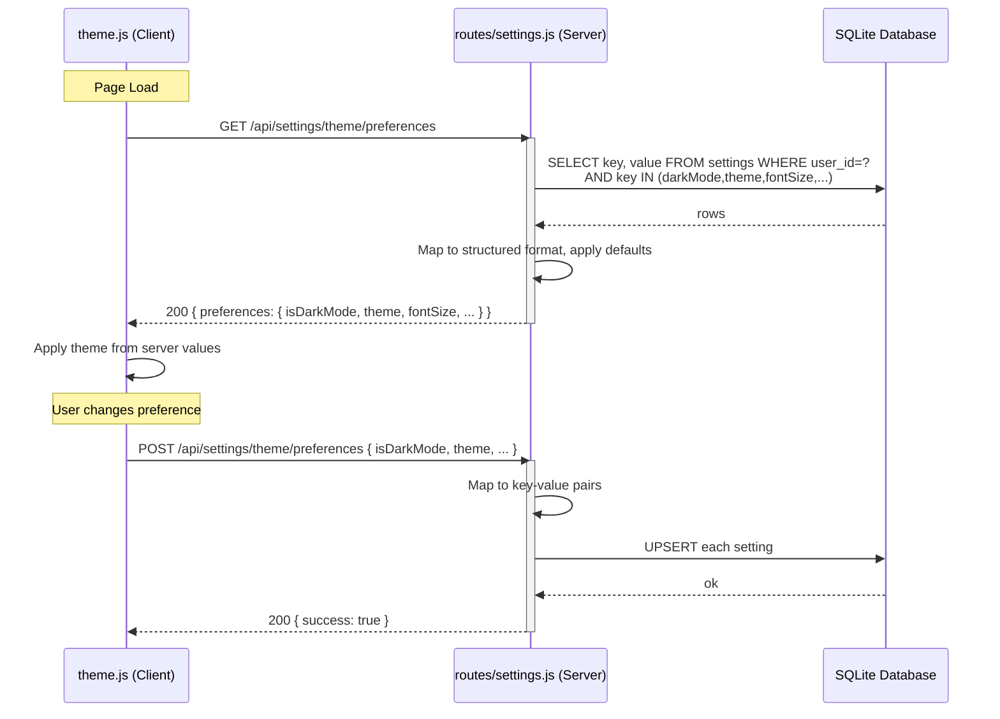

# Fix: `GET /api/settings/theme/preferences` 404 Error

## Problem

[`theme.js:42`](theme.js:42) makes a `GET` request to `/api/settings/theme/preferences` to load theme preferences from the server. [`theme.js:251`](theme.js:251) also makes a `POST` request to the same endpoint to save theme preferences. However, **no matching backend route exists** in [`routes/settings.js`](routes/settings.js), resulting in a 404 error.

**Console error:**
```
theme.js:42 GET http://localhost:3001/api/settings/theme/preferences 404 (Not Found)
```

## Root Cause Analysis

### Client-Side (`theme.js`)

The [`ThemeManager`](theme.js:8) class manages six theme-related preferences:

| Property | Type | localStorage Key | Purpose |
|---|---|---|---|
| `isDarkMode` | boolean | `theme-preference` | Dark/light mode toggle |
| `theme` | string | `selected-theme` | Theme name (pastel/cyber/mocha/etc.) |
| `fontSize` | string | `font-size` | Font size preset |
| `highContrast` | boolean | `high-contrast` | High contrast mode |
| `reduceMotion` | boolean | `reduce-motion` | Reduce motion preference |
| `animations` | boolean | `animations-enabled` | Animations toggle |

The client sends/receives a **structured payload** via `/api/settings/theme/preferences`:

**GET response expected** (line 42-48, 50-59):
```json
{
  "preferences": {
    "isDarkMode": true,
    "theme": "pastel",
    "fontSize": "medium",
    "highContrast": false,
    "reduceMotion": false,
    "animations": true
  }
}
```

**POST payload sent** (line 242-258):
```json
{
  "isDarkMode": true,
  "theme": "pastel",
  "fontSize": "medium",
  "highContrast": false,
  "reduceMotion": false,
  "animations": true
}
```

### Server-Side (`routes/settings.js`)

The existing backend has these settings-related routes:

| Route | Purpose |
|---|---|
| `GET /api/settings` | Get ALL settings (system + user merged) |
| `GET /api/settings/system-preferences` | Get system preferences (admin only) |
| `GET /api/settings/:key` | Get a single setting by key |
| `PUT /api/settings` | Update multiple settings |
| `PUT /api/settings/:key` | Update a single setting |
| `POST /api/settings` | Create/update a single setting |
| `POST /api/settings/system-preferences` | Update system preferences (admin only) |

**Missing:** `GET /api/settings/theme/preferences` and `POST /api/settings/theme/preferences`.

### Data Storage Convention

The [`settings.html`](settings.html:3570-3581) page saves theme-related settings with **camelCase keys** via `window.Api.updateSettings()`:
- `theme`, `fontSize`, `highContrast`, `reduceMotion`, `animations`

The seed script [`scripts/add-settings-table.js`](scripts/add-settings-table.js:52) also uses `darkMode` (camelCase).

The [`SETTINGS_SCHEMA`](routes/settings.js:85-137) in `routes/settings.js` uses **kebab-case** for some of these (e.g., `font-size`, `high-contrast`), but the actual stored keys come from whatever the client sends. The schema validation allows unknown keys through silently.

**Key insight:** The `theme.js` client sends `isDarkMode` (a property name not found in any existing stored setting), while the settings page would store `darkMode`. This will need mapping.

## Proposed Solution

Add **two new route handlers** to [`routes/settings.js`](routes/settings.js) (insert them after the system-preferences routes, around line 353):

### 1. `GET /api/settings/theme/preferences` (authenticated)

```
GET /api/settings/theme/preferences
Authorization: Bearer <token>
```

**Logic:**
1. Authenticate the user.
2. Query the `settings` table for user-specific keys: `darkMode`, `theme`, `fontSize`, `highContrast`, `reduceMotion`, `animations` (category: 'appearance').
3. Fall back to system-level (NULL user_id) settings if user-specific not found.
4. Apply sensible defaults for any missing keys:
   - `darkMode` → `false`
   - `theme` → `'pastel'`
   - `fontSize` → `'medium'`
   - `highContrast` → `false`
   - `reduceMotion` → `false`
   - `animations` → `true`
5. Map stored keys to the client's expected format:
   - `darkMode` → `isDarkMode` (cast to boolean)
   - `theme` → `theme`
   - `fontSize` → `fontSize`
   - `highContrast` → `highContrast` (cast to boolean)
   - `reduceMotion` → `reduceMotion` (cast to boolean)
   - `animations` → `animations` (cast to boolean)
6. Return `{ preferences: { isDarkMode, theme, fontSize, highContrast, reduceMotion, animations } }`.

### 2. `POST /api/settings/theme/preferences` (authenticated)

```
POST /api/settings/theme/preferences
Authorization: Bearer <token>
Content-Type: application/json

{
  "isDarkMode": true,
  "theme": "pastel",
  "fontSize": "medium",
  "highContrast": false,
  "reduceMotion": false,
  "animations": true
}
```

**Logic:**
1. Authenticate the user.
2. Validate the request body — ensure it's a non-null object.
3. Map client properties to stored keys:
   - `isDarkMode` → `darkMode` (stringify boolean)
   - `theme` → `theme`
   - `fontSize` → `fontSize`
   - `highContrast` → `highContrast` (stringify boolean)
   - `reduceMotion` → `reduceMotion` (stringify boolean)
   - `animations` → `animations` (stringify boolean)
4. Use `INSERT ... ON CONFLICT(user_id, key) DO UPDATE` to upsert each setting with `user_id = req.user.id`.
5. Return `{ success: true, message: 'Theme preferences saved successfully' }`.

### Edge Cases Handled

| Scenario | Behavior |
|---|---|
| Unauthenticated user | Route requires `authenticateToken` middleware; returns 401 |
| No stored preferences exist yet | Defaults applied; preferences returned successfully |
| Partial data in POST | Only provided fields are updated; missing fields ignored |
| Invalid POST body (non-object) | Returns 400 with error message |
| Database error | Returns 500 with error message |
| Type coercion | `isDarkMode`, `highContrast`, `reduceMotion`, `animations` values are explicitly cast to boolean when reading; stored as strings `'true'`/`'false'` when writing |

## Files to Modify

| File | Change |
|---|---|
| [`routes/settings.js`](routes/settings.js) | Add `GET /api/settings/theme/preferences` and `POST /api/settings/theme/preferences` routes (~80 lines total) |

## Files NOT Modified

| File | Reason |
|---|---|
| [`theme.js`](theme.js) | Client code is already correct; only missing server routes |
| [`api.js`](api.js) | No changes needed; the client uses `fetch()` directly, not `ApiClient` |
| [`settings.html`](settings.html) | Uses different save/load paths; no changes needed |

## Data Flow Diagram


