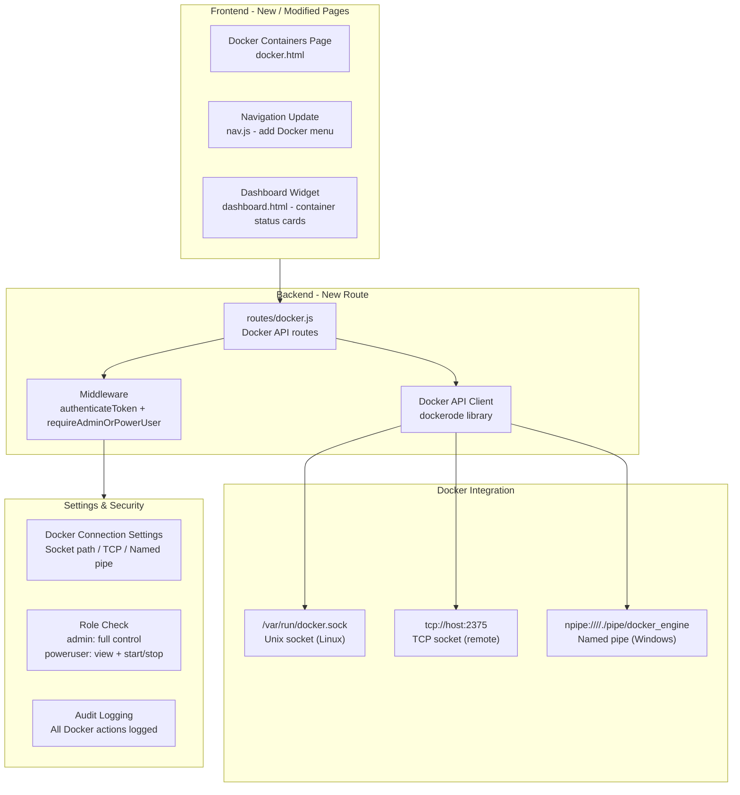
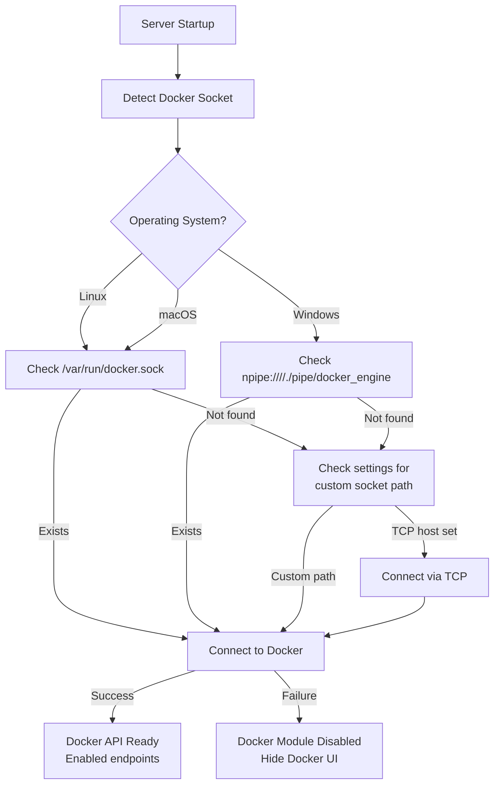
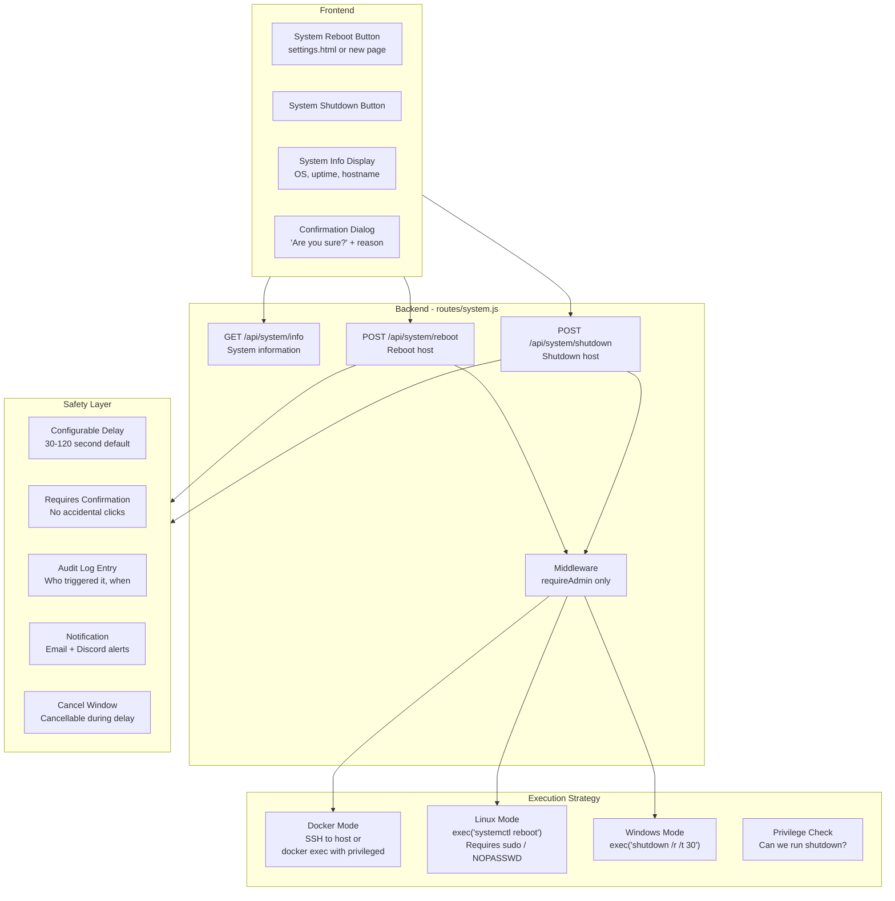
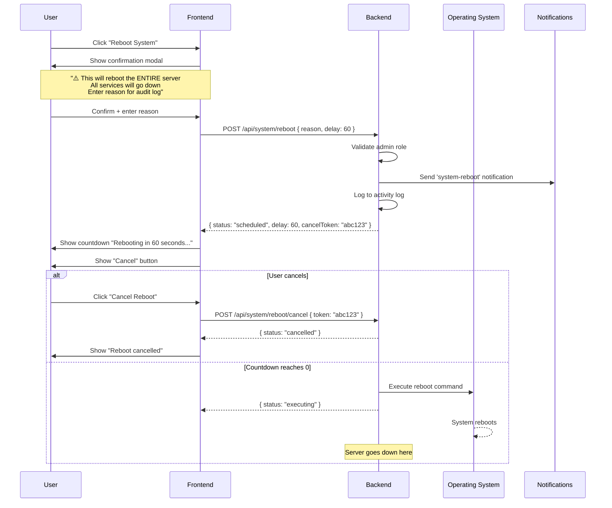

# Landio — Comprehensive Feature Assessment & Enhancement Plan

**Date:** 2026-06-26
**Project:** Landio (Server Dashboard & Services Portal)
**Stack:** Node.js/Express, SQLite3, Vanilla HTML/CSS/JS
**Version:** 1.0.0+

---

## 1. Executive Summary

Landio is a **self-hosted server management dashboard** designed for homelab and small-to-medium server environments. It provides a centralized web UI for monitoring self-hosted services, managing user accounts with RBAC, enforcing 2FA, SSO/OIDC integration, and sending notifications via SMTP/Discord.

**Strengths:** Excellent auth system (JWT + 2FA + SSO + RBAC), strong notification system, 40+ service templates, 6 themes, audit logging with export.
**Weaknesses:** No Docker management, no system management (CPU/RAM/disk), no real-time updates, no password reset, no backup system.

---

## 2. Feature Inventory — What Landio Currently Has

### Authentication & Security
| Feature | Status | Details |
|---------|--------|---------|
| JWT-based authentication | ✅ | Configurable expiry (default 24h) |
| Username/email login | ✅ | `findByIdentifier()` |
| Password hashing (bcrypt) | ✅ | 10 rounds |
| Account lockout | ✅ | Configurable attempts + duration |
| Password policy | ✅ | Min-length, uppercase, lowercase, numbers, special |
| Session management | ✅ | express-session with configurable timeout |
| IP whitelist | ✅ | CIDR support |
| Rate limiting | ✅ | Tiered (static, API, auth, 2FA) |
| CSP headers (Helmet) | ✅ | Relaxed (unsafe-inline) |
| 2FA (TOTP) | ✅ | speakeasy + QR codes + backup codes |
| 2FA enforcement | ✅ | Per-user, per-role, grace period |
| SSO / OIDC | ✅ | Authentik integration, group-to-role mapping |
| HTTPS with auto-certs | ✅ | Self-signed + HTTP→HTTPS redirect |
| Environment validation | ✅ | JWT_SECRET, SESSION_SECRET required at startup |

### User Management & RBAC
| Feature | Status | Details |
|---------|--------|---------|
| 3-tier RBAC | ✅ | admin, poweruser, user |
| User CRUD (admin) | ✅ | Create, read, update, delete |
| Paginated user list | ✅ | With search |
| User activity log | ✅ | Per-user action tracking |
| Onboarding flow | ✅ | 2FA enrollment for new users |
| Soft delete | ✅ | `is_deleted` flag |
| User profile updates | ✅ | Self + admin |
| Permissions JSON | ✅ | Granular permission overrides per user |

### Service Monitoring
| Feature | Status | Details |
|---------|--------|---------|
| 40+ service templates | ✅ | Nextcloud, Plex, GitLab, etc. |
| Service auto-discovery | ✅ | URL probing |
| Health checks | ✅ | HTTP probe, configurable interval/timeout |
| Uptime tracking | ✅ | percentage, total/successful checks |
| Response time tracking | ✅ | Average response time |
| Status indicators | ✅ | online/offline/maintenance |
| Access-level per service | ✅ | public/user/poweruser/admin |
| Custom icons | ✅ | Upload or template-based |
| Role-based service filtering | ✅ | Users see only permitted services |

### Notifications
| Feature | Status | Details |
|---------|--------|---------|
| SMTP email | ✅ | Configurable, TLS/STARTTLS |
| Discord webhooks | ✅ | Rich embeds with color coding |
| Per-event toggles | ✅ | 8 event types individually toggleable |
| Master toggles | ✅ | App notifications + User notifications |
| Admin email resolution | ✅ | From users table |
| SMTP password encoding | ✅ | Base64 + `b64:` prefix |
| Test endpoints | ✅ | SMTP + Discord test |

### Settings System
| Feature | Status | Details |
|---------|--------|---------|
| Dual-scope settings | ✅ | System-level + User-level |
| Key-value store | ✅ | Flexible, schema-validated |
| Batch update | ✅ | PUT /api/settings |
| Theme preferences | ✅ | Server-persisted |
| Security settings | ✅ | 2FA enforcement, session timeout, lockout |
| SMTP settings | ✅ | Full configuration |
| Discord settings | ✅ | Webhook + username |
| Schema validation | ✅ | Type checking + clamping |

### Audit & Logging
| Feature | Status | Details |
|---------|--------|---------|
| Activity log | ✅ | All auth + CRUD events |
| Pagination + filters | ✅ | user_id, action, date range, search |
| CSV export | ✅ | With proper escaping |
| JSON export | ✅ | With metadata |
| Stats endpoint | ✅ | Counts by action, last 24h |
| Clear logs | ✅ | Admin only, self-logged |

### Frontend & UX
| Feature | Status | Details |
|---------|--------|---------|
| 6 themes | ✅ | Pastel, Cyber, Mocha, Ice, Nature, Sunset |
| Dark/Light mode | ✅ | Toggle per user |
| Font size options | ✅ | 4 sizes |
| High contrast mode | ✅ | Accessibility |
| Reduce motion | ✅ | Accessibility |
| Font Awesome (self-hosted) | ✅ | No CDN dependency |
| Responsive design | ✅ | Mobile-friendly |
| Role-based navigation | ✅ | Dynamic menus per role |

### Deployment
| Feature | Status | Details |
|---------|--------|---------|
| Node.js direct | ✅ | npm start / npm run dev |
| Docker | ✅ | Multi-stage build, healthcheck |
| Docker Compose | ✅ | Volumes, network, env config |
| Reverse proxy | ✅ | Nginx, Caddy, Traefik, Apache |
| HTTPS auto-certs | ✅ | Self-signed generation |
| Deployment script | ✅ | deploy.sh |
| CI/CD | ✅ | GitHub Actions (test, code-quality, build) |
| Test framework | ✅ | Jest + Supertest configured |
| Unit tests | ✅ | Auth, 2FA, settings, services, users, notifications |

---

## 3. Competitive Analysis — Similar Apps Comparison

| Feature | **Landio** | **Heimdall** | **Dashy** | **Organizr** | **Cockpit** | **Portainer** | **Homarr** |
|---------|:----------:|:------------:|:---------:|:------------:|:-----------:|:-------------:|:----------:|
| **Auth & Security** | | | | | | | |
| JWT Authentication | ✅ | ❌ | ✅ | ✅ | ✅ | ✅ | ❌ |
| 2FA / TOTP | ✅ | ❌ | ❌ | ✅ | ❌ | ✅ | ❌ |
| SSO / OIDC | ✅ | ❌ | ❌ | ✅ | ✅ | ✅ | ❌ |
| RBAC (3+ tiers) | ✅ | ❌ | ❌ | ✅ | ✅ | ✅ | ❌ |
| IP whitelist | ✅ | ❌ | ❌ | ❌ | ❌ | ❌ | ❌ |
| **Service Management** | | | | | | | |
| Service links/bookmarks | ✅ | ✅ | ✅ | ✅ | ❌ | ❌ | ✅ |
| Health checks | ✅ | ❌ | ✅ | ❌ | ✅ | ✅ | ✅ |
| Auto-discovery | ✅ | ❌ | ❌ | ❌ | ❌ | ✅ | ❌ |
| Uptime tracking | ✅ | ❌ | ❌ | ❌ | ❌ | ❌ | ❌ |
| 40+ templates | ✅ | ✅ | ❌ | ❌ | ❌ | ❌ | ❌ |
| **Docker Management** | | | | | | | |
| Container list/view | ❌ | ❌ | ❌ | ❌ | ✅ | ✅ | ❌ |
| Start/Stop/Restart | ❌ | ❌ | ❌ | ❌ | ✅ | ✅ | ❌ |
| Container logs | ❌ | ❌ | ❌ | ❌ | ✅ | ✅ | ❌ |
| Container stats (CPU/RAM) | ❌ | ❌ | ❌ | ❌ | ✅ | ✅ | ❌ |
| Image management | ❌ | ❌ | ❌ | ❌ | ❌ | ✅ | ❌ |
| Compose management | ❌ | ❌ | ❌ | ❌ | ❌ | ✅ | ❌ |
| **System Management** | | | | | | | |
| System info (CPU/RAM/Disk) | ❌ | ❌ | ❌ | ❌ | ✅ | ❌ | ❌ |
| Reboot / Shutdown | ❌ | ❌ | ❌ | ❌ | ✅ | ❌ | ❌ |
| Process management | ❌ | ❌ | ❌ | ❌ | ✅ | ❌ | ❌ |
| Web terminal | ❌ | ❌ | ❌ | ❌ | ✅ | ✅ | ❌ |
| File manager | ❌ | ❌ | ❌ | ❌ | ✅ | ❌ | ❌ |
| **Notifications** | | | | | | | |
| Email (SMTP) | ✅ | ❌ | ❌ | ❌ | ✅ | ❌ | ❌ |
| Discord webhooks | ✅ | ❌ | ❌ | ❌ | ❌ | ❌ | ❌ |
| Push/WebSocket | ❌ | ❌ | ❌ | ❌ | ✅ | ✅ | ❌ |
| **User Experience** | | | | | | | |
| Themes | ✅ (6) | ✅ (few) | ✅ (many) | ✅ | ✅ | ✅ | ✅ |
| Dark mode | ✅ | ✅ | ✅ | ✅ | ✅ | ✅ | ✅ |
| Responsive | ✅ | ✅ | ✅ | ✅ | ✅ | ✅ | ✅ |
| **Other** | | | | | | | |
| Audit logging | ✅ | ❌ | ❌ | ❌ | ✅ | ✅ | ❌ |
| Activity log export | ✅ | ❌ | ❌ | ❌ | ❌ | ❌ | ❌ |
| Password reset | ❌ | ❌ | ❌ | ✅ | ✅ | ✅ | ❌ |
| User self-registration | ❌ | ❌ | ❌ | ❌ | ❌ | ❌ | ❌ |
| Automated backups | ❌ | ❌ | ❌ | ❌ | ❌ | ✅ | ❌ |
| Real-time updates | ❌ | ❌ | ❌ | ❌ | ✅ | ✅ | ❌ |
| Web terminal | ❌ | ❌ | ❌ | ❌ | ✅ | ✅ | ❌ |

---

## 4. Identified Feature Gaps

### Critical Gaps (High Priority)

| # | Gap | Why Critical | Similar Apps Have It |
|---|-----|-------------|---------------------|
| **G1** | **Docker Container Management** | Users running Landio in Docker (or alongside Docker) have no way to manage containers from the dashboard. This is the #1 ask for dashboard tools. | Cockpit, Portainer |
| **G2** | **System Reboot/Shutdown** | Admins need a way to reboot/shutdown the host server without SSH access. Current health check API has no system control. | Cockpit |
| **G3** | **Password Reset Flow** | Declared in `.env.example` as `ENABLE_PASSWORD_RESET=true` but NOT implemented. Essential for user self-service. | Organizr, Cockpit, Portainer |

### High-Value Gaps (Medium Priority)

| # | Gap | Why Valuable | Similar Apps Have It |
|---|-----|-------------|---------------------|
| **G4** | **System Resource Monitoring** | CPU, RAM, disk, network info visible on dashboard. Provides at-a-glance server health. | Cockpit, Portainer (container-level) |
| **G5** | **Automated Database Backups** | SQLite data needs protection. No backup UI or scheduling exists. | Portainer |
| **G6** | **Real-Time Updates (WebSocket)** | Dashboard requires manual refresh for service status changes. Push updates would improve UX significantly. | Cockpit, Portainer |

### Enhancement Gaps (Low Priority)

| # | Gap | Notes |
|---|-----|-------|
| **G7** | User Self-Registration / Invite System | Optional but useful for multi-user environments |
| **G8** | Email Template System | Current inline HTML strings could be refactored to templates |
| **G9** | API Versioning | All routes at `/api/*` with no version prefix |
| **G10** | Web Terminal (SSH) | Would replace need for separate SSH client for basic tasks |

---

## 5. Enhancement Plan: Docker Container Control

### 5.1 Overview

Add a **Docker management module** to Landio that allows admins and power users to:
- View all running/stopped containers
- Start, stop, restart containers
- View container logs
- View container resource usage (CPU, memory, network)
- Launch a terminal session into a container (basic exec)

### 5.2 Architecture



### 5.3 Backend Implementation

#### New Dependency
- **dockerode** — Node.js Docker client (well-maintained, 3k+ stars, supports all Docker API operations)

#### New File: `routes/docker.js`
| Endpoint | Method | Access | Description |
|----------|--------|--------|-------------|
| `/api/docker/info` | GET | Admin/PowerUser | Docker system info (version, containers, images, etc.) |
| `/api/docker/containers` | GET | Admin/PowerUser | List all containers with status |
| `/api/docker/containers/:id` | GET | Admin/PowerUser | Get container details (inspect) |
| `/api/docker/containers/:id/start` | POST | Admin/PowerUser | Start container |
| `/api/docker/containers/:id/stop` | POST | Admin/PowerUser | Stop container |
| `/api/docker/containers/:id/restart` | POST | Admin/PowerUser | Restart container |
| `/api/docker/containers/:id/logs` | GET | Admin/PowerUser | Stream container logs (last N lines) |
| `/api/docker/containers/:id/stats` | GET | Admin/PowerUser | Container resource stats (CPU, memory, network) |
| `/api/docker/containers/:id/exec` | POST | Admin | Execute command in container |

#### New/Modified: `server.js`
- Add rate limiter for Docker endpoints
- Mount `routes/docker.js` at `/api/docker`
- Docker socket detection on startup

#### Settings Schema Addition (in `routes/settings.js`)
| Setting | Type | Default | Description |
|---------|------|---------|-------------|
| `docker-auto-detect` | boolean | true | Auto-detect Docker socket |
| `docker-socket-path` | string | `/var/run/docker.sock` | Custom Docker socket path |
| `docker-tcp-host` | string | `''` | TCP host (for remote Docker) |
| `docker-tcp-port` | number | 2375 | TCP port |
| `docker-tls-enabled` | boolean | false | TLS for TCP connections |

#### Settings in UI (`settings.html`)
- Add "Docker" section under Administrator tab
- Connection type selector (Socket / TCP / Named Pipe)
- Connection test button
- Security notice about socket permissions

### 5.4 Frontend Implementation

#### New File: `docker.html`
A full container management page with:
- **Container list** — Table/card view with status indicators (running/stopped/paused)
- **Bulk actions** — Select multiple containers for start/stop/restart
- **Quick actions** — Per-container buttons for start, stop, restart, view logs
- **Container details** — Inspect view with:
  - Image, ports, volumes, networks
  - Environment variables (obfuscated values)
  - Mounts
  - Resource limits
- **Log viewer** — Scrollable log window with:
  - Tail mode (follow logs)
  - Timestamp toggle
  - Search/filter
  - Download logs
- **Stats viewer** — Real-time CPU and memory usage (polling-based)

#### Modified: `nav.js`
- Add "Docker" menu item to admin submenu
- Add "Docker" menu item to poweruser submenu (if permitted)

#### Modified: `dashboard.html` / `index.html`
- Optional "Docker Containers" widget showing container status counts
- Quick action buttons for common operations

#### Modified: `auth.js`
- Add `canManageDocker` permission
  - admin: full control
  - poweruser: view + start/stop
  - user: none

#### Modified: `settings.html`
- Add Docker connection configuration section
- Connection test button

### 5.5 Security Considerations

1. **Docker socket exposure**: The Docker socket gives root-equivalent access. Must be protected:
   - Only admins get full Docker control
   - Power users get view + start/stop (no exec, no inspect of sensitive config)
   - Confirmation dialog for destructive actions (stop, restart)
   - All Docker actions logged to activity log

2. **Socket permission check**: Backend should verify the socket is accessible before exposing endpoints.

3. **TCP security**: If using TCP, require TLS and client certificates.

4. **Audit trail**: Every Docker action logged with user, container, action, timestamp.

### 5.6 Docker Detection & Connection Flow



---

## 6. Enhancement Plan: System Reboot/Shutdown

### 6.1 Overview

Add a **system control module** that allows admins to:
- **Reboot** the host system
- **Shutdown** the host system
- View system information (OS, uptime, hostname)
- **Critical**: This must work differently based on deployment context:
  - **Docker**: Reboot host system via SSH or host command execution
  - **Non-Docker (Direct Node.js)**: Execute system reboot
  - **Windows**: Use `shutdown /r /t 0` (reboot) or `shutdown /s /t 0` (shutdown)
  - **Linux**: Use `systemctl reboot` or `shutdown -r now`

### 6.2 Architecture



### 6.3 Backend Implementation

#### New File: `routes/system.js`
| Endpoint | Method | Access | Description |
|----------|--------|--------|-------------|
| `/api/system/info` | GET | Admin/PowerUser | OS, hostname, uptime, kernel, load, memory |
| `/api/system/reboot` | POST | Admin | Reboot the host system |
| `/api/system/shutdown` | POST | Admin | Shutdown the host system |
| `/api/system/reboot/cancel` | POST | Admin | Cancel pending reboot |
| `/api/system/status` | GET | Admin | Current pending operation status |

#### System Info Response (`GET /api/system/info`)
```json
{
  "hostname": "server-01",
  "platform": "linux",
  "os": "Ubuntu 22.04.3 LTS",
  "kernel": "5.15.0-91-generic",
  "uptime": 1209600,
  "uptimeHuman": "14 days, 0 hours",
  "arch": "x64",
  "isDocker": true,
  "cpuModel": "Intel(R) Core(TM) i7-10700K",
  "cpuCores": 8,
  "memory": {
    "total": 33554432,
    "used": 12582912,
    "free": 20971520,
    "percentUsed": 37.5
  },
  "disk": {
    "total": 512110190592,
    "used": 256055095296,
    "free": 256055095296,
    "percentUsed": 50.0
  },
  "loadAvg": [1.5, 1.2, 1.0]
}
```

#### Execution Strategy (`routes/system.js`)

```javascript
// Docker detection
const isRunningInDocker = () => {
  try {
    return fs.existsSync('/.dockerenv') || 
           fs.readFileSync('/proc/1/cgroup', 'utf8').includes('docker');
  } catch {
    return false;
  }
};

// Reboot execution
const executeReboot = () => {
  const platform = process.platform;
  
  if (platform === 'win32') {
    // Windows: shutdown /r /t 30
    return exec('shutdown /r /t 30 /c "Landio Dashboard initiated reboot"');
  } else if (platform === 'linux' || platform === 'darwin') {
    if (isRunningInDocker()) {
      // Docker: Need to reboot HOST, not container
      // Option 1: /var/run/docker.sock -> docker exec on host (requires host access)
      // Option 2: SSH to host (requires SSH key configured)
      // Option 3: Bind-mounted /var/run/docker.sock -> use host's Docker
      return rebootHostViaDocker();
    }
    // Direct: systemctl reboot or shutdown -r now
    return exec('sudo /sbin/shutdown -r +1 "Landio Dashboard initiated reboot"');
  }
};
```

#### Docker-specific Host Reboot Strategies

**Strategy A — Docker Socket (Recommended)**
If Landio has access to the Docker socket, it can run a privileged container on the host to execute the reboot:
```javascript
const Docker = require('dockerode');
const docker = new Docker({ socketPath: '/var/run/docker.sock' });

async function rebootHostViaDocker() {
  // Run a temporary privileged container that reboots the host
  await docker.run('alpine', ['sh', '-c', 'echo "Landio reboot" > /dev/tty1 && reboot'], process.stdout);
}
```

**Strategy B — SSH to Host**
Configure SSH credentials in settings to SSH into the host and run reboot:
```javascript
const { exec } = require('child_process');
async function rebootViaSSH(host, sshKey) {
  exec(`ssh -i ${sshKey} root@${host} 'shutdown -r +1 "Landio initiated"'`);
}
```

**Strategy C — Bind-mounted Docker Binary**
If the host's Docker binary is bind-mounted into the container:
```yaml
volumes:
  - /var/run/docker.sock:/var/run/docker.sock
  - /usr/bin/docker:/usr/bin/docker  # Optional
```

### 6.4 Safety & Confirmation System



### 6.5 Frontend Implementation

#### New Section in `settings.html`
Add a "System Control" section under the Administrator tab:
- **System Information Card**:
  - Hostname, OS, kernel, uptime
  - CPU model, cores
  - Memory usage bar
  - Disk usage bar
  - Docker detection indicator
- **System Control Card**:
  - **Reboot** button (red, prominent)
  - **Shutdown** button (red, prominent)
  - Confirmation dialog with:
    - Warning text about impact
    - Reason text field (required for audit)
    - Delay selector (30s, 60s, 120s)
    - Confirm / Cancel buttons
  - Countdown display if pending
  - Cancel button during countdown

#### Modified: `nav.js`
- Add "System" section under admin submenu (or link to settings page)
- Could add a quick status icon in header showing system health

#### Modified: `routes/settings.js`
- Add system control settings to schema:
  - `system-reboot-enabled` (boolean, default: true)
  - `system-reboot-require-reason` (boolean, default: true)
  - `system-reboot-default-delay` (number, default: 60)
  - `system-shutdown-enabled` (boolean, default: true)

### 6.6 Permission Model

| Action | admin | poweruser | user |
|--------|-------|-----------|------|
| View system info | ✅ | ✅ | ❌ |
| View system info (sensitive) | ✅ | ❌ | ❌ |
| Reboot system | ✅ | configurable | ❌ |
| Shutdown system | ✅ | configurable | ❌ |
| Cancel pending reboot | ✅ | ✅ (own) | ❌ |

### 6.7 Configuration Settings

New settings in the `settings` table:
| Setting | Type | Default | Description |
|---------|------|---------|-------------|
| `system-reboot-enabled` | boolean | true | Enable/disable reboot functionality |
| `system-shutdown-enabled` | boolean | true | Enable/disable shutdown functionality |
| `system-reboot-delay` | number | 60 | Delay in seconds before reboot |
| `system-reboot-require-reason` | boolean | true | Require reason for audit |
| `system-reboot-allow-poweruser` | boolean | false | Allow power users to reboot |
| `system-ssh-host` | string | '' | SSH host for Docker mode |
| `system-ssh-key-path` | string | '' | SSH key path for Docker mode |

---

## 7. Implementation Roadmap

### Phase A — Docker Container Control (Priority 1)

| Step | Files | Description |
|------|-------|-------------|
| 1 | `npm install dockerode` | Install Docker client library |
| 2 | `routes/docker.js` (new) | Docker API routes (CRUD + logs + stats) |
| 3 | `server.js` | Mount docker routes, Docker socket detection |
| 4 | `middleware/auth.js` | Add Docker permission checks if needed |
| 5 | `lib/docker.js` (new) | Docker helper functions (connection, detection) |
| 6 | `docker.html` (new) | Container management frontend page |
| 7 | `nav.js` | Add Docker to admin/poweruser menus |
| 8 | `auth.js` | Add `canManageDocker` permission |
| 9 | `settings.html` | Docker connection configuration |
| 10 | `routes/settings.js` | Docker settings schema |
| 11 | `styles/pages/docker.css` (new) | Docker page styles |
| 12 | Tests | Add Docker route tests |

### Phase B — System Reboot/Shutdown (Priority 2)

| Step | Files | Description |
|------|-------|-------------|
| 1 | `routes/system.js` (new) | System info + reboot/shutdown endpoints |
| 2 | `server.js` | Mount system routes |
| 3 | `lib/system.js` (new) | System utilities (Docker detection, platform detection) |
| 4 | `settings.html` | System control section + confirmation dialog |
| 5 | `nav.js` | Add system status indicator |
| 6 | `styles/pages/system.css` (new) | System control styles |
| 7 | `routes/settings.js` | System control settings schema |
| 8 | `routes/notifications.js` | Add `system-reboot` and `system-shutdown` event types |
| 9 | Tests | Add system route tests |

### Phase C — Security Hardening (Run in parallel)

| Step | Description |
|------|-------------|
| 1 | Ensure Docker socket permissions are checked |
| 2 | Add rate limiting to reboot/shutdown endpoints |
| 3 | Log all Docker and system actions to activity log |
| 4 | Add confirmation dialogs for all destructive actions |

---

## 8. Risk Assessment

| Risk | Likelihood | Impact | Mitigation |
|------|-----------|--------|------------|
| Docker socket exposure | Low | Critical | Restrict to admin, validate socket permissions |
| Accidental reboot/shutdown | Medium | Critical | Confirmation dialog, reason required, configurable delay, cancel window |
| Reboot during active sessions | Medium | High | Send notification before reboot, adequate delay |
| Docker TCP without TLS | Medium | High | Warn in UI, require TLS checkbox |
| Permission escalation via Docker exec | Low | Critical | Restrict exec to admin only, audit log all exec commands |
| Platform incompatibility | Low | Medium | Platform detection, graceful fallback with clear error messages |

---

## 9. Summary of What Will Be Built

### Docker Container Control (New Feature)
- **Backend**: 10+ API endpoints via `dockerode` for full container lifecycle management
- **Frontend**: Dedicated `docker.html` page with container list, logs viewer, stats charts
- **Settings**: Docker connection type configuration (socket, TCP, named pipe)
- **Integration**: Audit logging, RBAC enforcement, navigation menu

### System Reboot/Shutdown (New Feature)
- **Backend**: 4 API endpoints for system info, reboot, shutdown, cancel
- **Frontend**: System control UI in settings with confirmation dialog and countdown
- **Docker-aware**: Detects Docker environment and uses appropriate host reboot strategy
- **Safety**: Configurable delay, reason requirement, cancel window, notifications

### Total New Files: ~8
| File | Purpose |
|------|---------|
| `routes/docker.js` | Docker API endpoints |
| `lib/docker.js` | Docker connection utilities |
| `docker.html` | Docker management page |
| `styles/pages/docker.css` | Docker page styles |
| `routes/system.js` | System info + reboot/shutdown endpoints |
| `lib/system.js` | System utilities (platform detection, command execution) |
| `styles/pages/system-control.css` | System control styles |
| `tests/docker.test.js` | Docker route tests |
| `tests/system.test.js` | System route tests |

### Total Modified Files: ~10
| File | Changes |
|------|---------|
| `server.js` | Mount new routes, Docker detection on startup |
| `nav.js` | Add Docker + System menu items |
| `auth.js` | Add Docker + System permissions |
| `settings.html` | Docker config + System control sections |
| `routes/settings.js` | Docker + System settings schema |
| `routes/notifications.js` | New event types |
| `middleware/auth.js` | Any new permission middleware |
| `package.json` | Add `dockerode` dependency |
| `manage-services.html` | (Optional) Link to Docker |
| `dashboard.html` | (Optional) Docker widget |

---

## 10. Architectural Decisions

| Decision | Choice | Rationale |
|----------|--------|-----------|
| Docker client library | `dockerode` | Most popular, well-maintained, full API support, active community |
| System reboot execution | Child process + platform detection | No external dependencies needed, works cross-platform |
| Docker reboot strategy | Docker socket → run privileged container | Most reliable for containerized deployments, no SSH config needed |
| Real-time container stats | Polling (3s interval) | Simpler than WebSocket for initial implementation, can upgrade later |
| UI approach | New dedicated pages | Keeps code organized, avoids bloating existing pages |
| Permission model | Extend existing RBAC | Reuses established patterns, consistent with current architecture |
