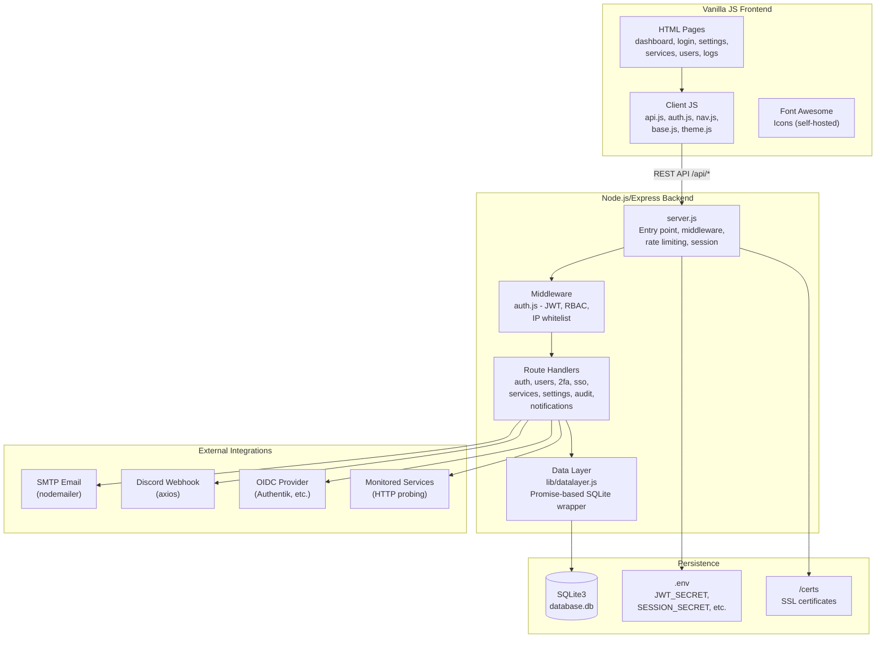
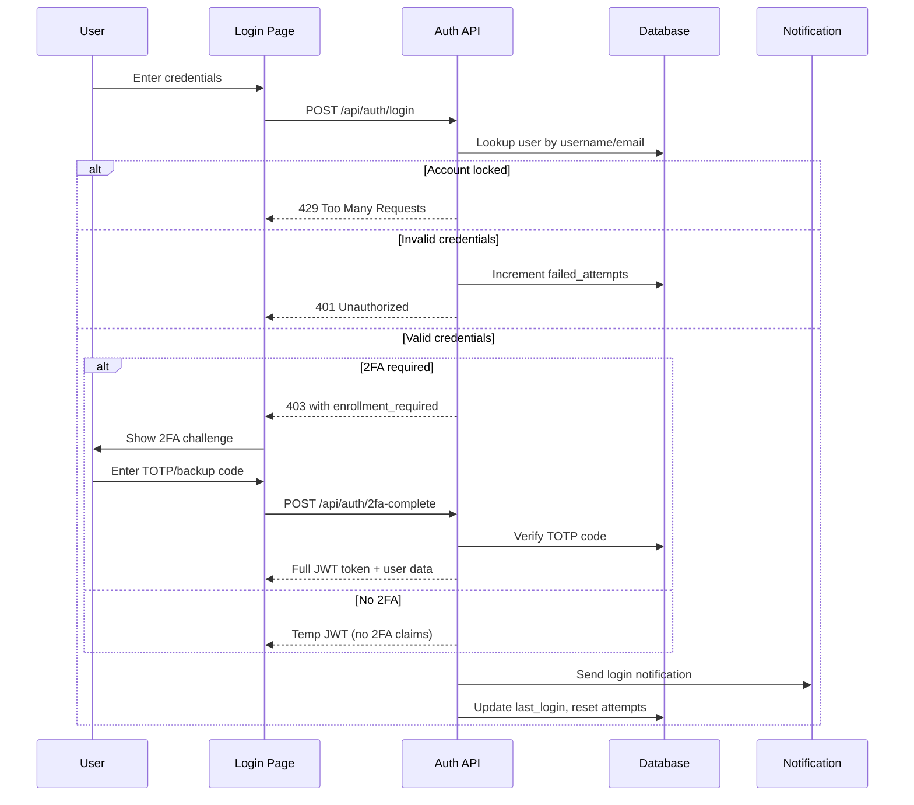
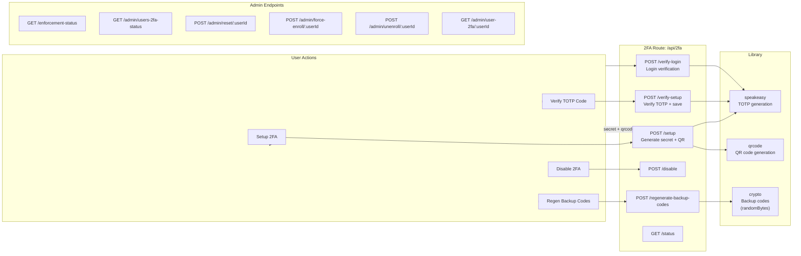
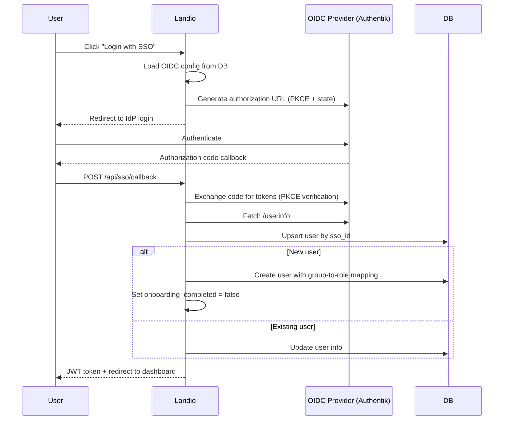
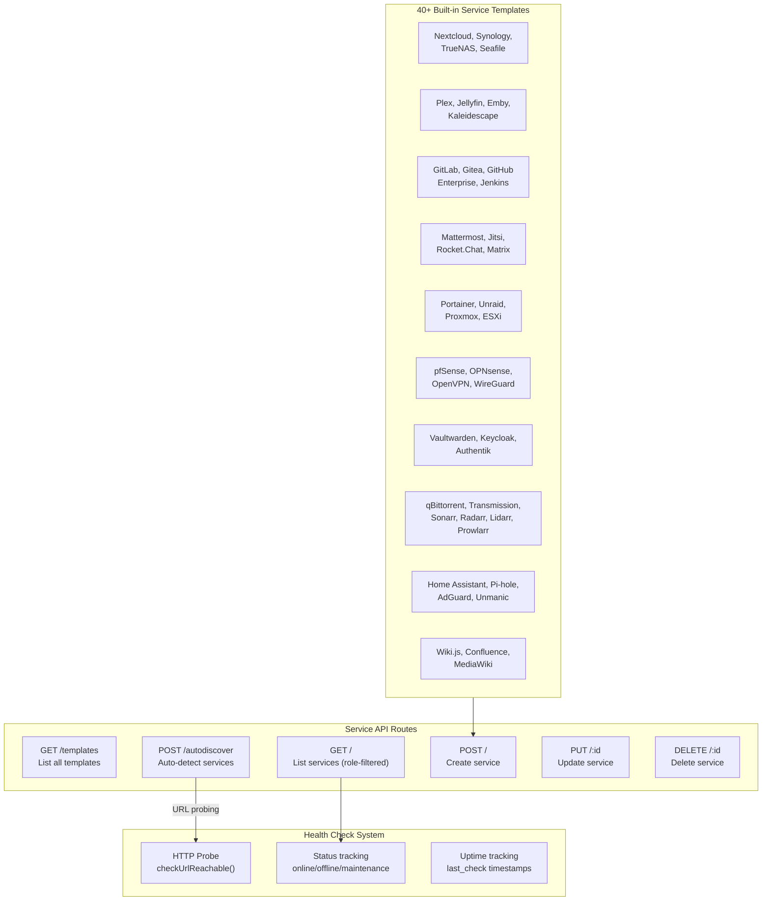
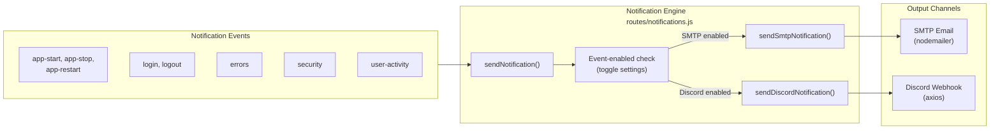
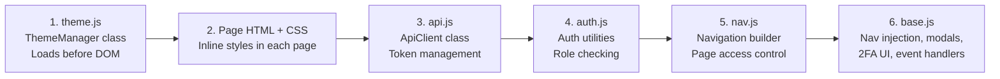
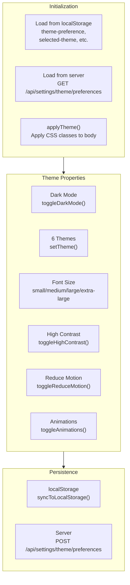
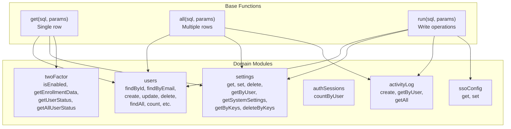

# Landio - Full Feature Assessment

**Date:** 2026-06-26  
**Project:** Landio (Server Dashboard Backend)  
**Stack:** Node.js/Express, SQLite3, vanilla HTML/CSS/JS frontend  
**Version:** 1.0.0+

---

## Table of Contents
1. [System Overview](#1-system-overview)
2. [Authentication & Security](#2-authentication--security)
3. [User Management & RBAC](#3-user-management--rbac)
4. [Two-Factor Authentication (2FA)](#4-two-factor-authentication-2fa)
5. [SSO / OIDC Integration](#5-sso--oidc-integration)
6. [Service Monitoring](#6-service-monitoring)
7. [Notifications System](#7-notifications-system)
8. [Settings Engine](#8-settings-engine)
9. [Audit & Logging](#9-audit--logging)
10. [Frontend Architecture](#10-frontend-architecture)
11. [Theme System](#11-theme-system)
12. [Database Schema & Data Layer](#12-database-schema--data-layer)
13. [Deployment & Infrastructure](#13-deployment--infrastructure)
14. [Issues & Recommendations](#14-issues--recommendations)

---

## 1. System Overview

Landio is a **server management dashboard** designed for homelab and small-to-medium server environments. It provides a centralized web UI for:

- Monitoring the health/status of self-hosted services
- Managing user accounts with role-based access
- Enforcing two-factor authentication
- Integrating with SSO providers (Authentik/OIDC)
- Sending notifications via SMTP email and Discord webhooks
- Customizing appearance with themes and dark mode

### Architecture Diagram



### File Inventory (Key Files)

| File | Size | Purpose |
|------|------|---------|
| [`server.js`](server.js) | 531 lines | Main server entry, middleware config, DB schema, HTTPS |
| [`middleware/auth.js`](middleware/auth.js) | 178 lines | JWT auth, role guards, IP whitelist |
| [`lib/datalayer.js`](lib/datalayer.js) | 572 lines | Promise-based SQLite data access layer |
| [`routes/auth.js`](routes/auth.js) | 701 lines | Login, logout, setup, token refresh, 2FA completion |
| [`routes/users.js`](routes/users.js) | 643 lines | User CRUD, onboarding, activity, permissions |
| [`routes/2fa.js`](routes/2fa.js) | 531 lines | TOTP setup, verification, backup codes, admin management |
| [`routes/sso.js`](routes/sso.js) | 535 lines | OIDC config, login, callback, group-to-role mapping |
| [`routes/services.js`](routes/services.js) | 807 lines | 40+ service templates, auto-discovery, health checks |
| [`routes/settings.js`](routes/settings.js) | 760 lines | Settings CRUD, SMTP/Discord test, system preferences |
| [`routes/notifications.js`](routes/notifications.js) | 398 lines | Dual-channel notification dispatch (SMTP + Discord) |
| [`routes/audit.js`](routes/audit.js) | 241 lines | Activity log query, pagination, CSV/JSON export |
| [`theme.js`](theme.js) | 313 lines | ThemeManager class: dark mode, 6 themes, accessibility |
| [`api.js`](api.js) | 271 lines | ApiClient class: REST client with token refresh |
| [`auth.js`](auth.js) | 145 lines | Client-side auth utilities, role permissions |
| [`nav.js`](nav.js) | 463 lines | Navigation builder, role-based page access control |
| [`base.js`](base.js) | 2035 lines | Core frontend: nav injection, CSS, profile modals, 2FA UI |

---

## 2. Authentication & Security

### 2.1 Authentication Flow



**Key Features:**
- **JWT-based** authentication with configurable expiry (default 24h)
- **Username or email** login supported (`findByIdentifier`)
- **Account lockout** after configurable failed attempts (default 5), configurable duration (default 900s)
- **Password policy** validation: min-length, uppercase, lowercase, numbers, special characters
- **Session timeout** per user via the `session-timeout` setting (in seconds)
- **Token refresh** mechanism at `POST /api/auth/refresh`
- **First-run setup** flow: checks `GET /api/auth/setup/status`, redirects to `setup.html` if no admin exists
- **2FA enforcement** with grace period and `enrollment_required` flag per user

### 2.2 Security Middleware Stack

| Middleware | Configuration | Location |
|------------|---------------|----------|
| **Helmet.js** | CSP with `unsafe-inline`, relaxed for dev | [`server.js:41-57`](server.js:41-57) |
| **Rate Limiting (general)** | 100 requests / 15 min window | [`server.js:60-64`](server.js:60-64) |
| **Rate Limiting (static)** | 1000 requests / 15 min | [`server.js:67-83`](server.js:67-83) |
| **Rate Limiting (API)** | 100 requests / 15 min | [`server.js:86-90`](server.js:86-90) |
| **Rate Limiting (2FA)** | 10 requests / 15 min | [`routes/2fa.js:10-16`](routes/2fa.js:10-16) |
| **CORS** | Validates origin against patterns, permissive defaults | [`server.js:95-126`](server.js:95-126) |
| **Session** | express-session, in-memory store, 1h timeout | [`server.js:133-142`](server.js:133-142) |
| **JWT Auth** | Bearer token extraction, DB user verification, active check | [`middleware/auth.js:11-105`](middleware/auth.js:11-105) |
| **IP Whitelist** | CIDR support for IP-based access control | [`middleware/auth.js:76-99`](middleware/auth.js:76-99) |
| **2FA Enrollment Auth** | Separate middleware for enrollment flow tokens | [`middleware/auth.js:108-153`](middleware/auth.js:108-153) |

### 2.3 Role Hierarchy & Permissions

```
admin → poweruser → user
```

| Permission | admin | poweruser | user |
|------------|-------|-----------|------|
| View dashboard services | ✓ | ✓ | ✓ |
| Edit own profile | ✓ | ✓ | ✓ |
| Change own password | ✓ | ✓ | ✓ |
| Configure 2FA | ✓ | ✓ | ✓ |
| Manage user settings | ✓ | ✓ | ✓ |
| Create/manage services | ✓ | ✓ | ✗ |
| Access audit logs | ✓ | ✓ | ✗ |
| Manage users (CRUD) | ✓ | ✗ | ✗ |
| System settings | ✓ | ✗ | ✗ |
| SSO configuration | ✓ | ✗ | ✗ |
| View all users | ✓ | ✗ | ✗ |
| Reset other users' 2FA | ✓ | ✗ | ✗ |
| Clear activity logs | ✓ | ✗ | ✗ |

---

## 3. User Management & RBAC

### 3.1 User CRUD Endpoints

| Endpoint | Method | Access | Description |
|----------|--------|--------|-------------|
| `/api/users` | GET | Admin | Paginated user list with search |
| `/api/users/:id` | GET | Self/Admin | Get user details |
| `/api/users/:id/2fa-status` | GET | Self/Admin | Get 2FA enrollment status |
| `/api/users` | POST | Admin | Create new user |
| `/api/users/:id` | PUT | Self/Admin | Update user (dynamic fields) |
| `/api/users/:id` | DELETE | Admin | Delete user (not self, last admin check) |
| `/api/users/:id/activity` | GET | Admin | User activity log |
| `/api/users/:id/reset-2fa` | POST | Admin | Reset another user's 2FA |
| `/api/users/onboarding/status` | GET | Auth'd | Check onboarding completion |
| `/api/users/onboarding/complete` | POST | Auth'd | Complete onboarding |

### 3.2 User Schema (28 columns)

Key columns in the [`users`](server.js:199-254) table:
- `id, username, email, display_name, password_hash`
- `role` (admin/poweruser/user)
- `is_active`, `is_deleted` (soft delete)
- `failed_attempts`, `locked_until`, `last_failed_attempt`
- `sso_provider`, `sso_id`
- `onboarding_completed`
- `permissions` (JSON blob for granular overrides)
- `created_at`, `updated_at`, `last_login`

### 3.3 Onboarding Flow

New users (including SSO-created) go through an onboarding flow at `onboarding.html` (1032 lines) that:
1. Checks `GET /api/users/onboarding/status`
2. Guides user through 2FA enrollment
3. Marks `onboarding_completed = true`

---

## 4. Two-Factor Authentication (2FA)

### 4.1 Architecture



### 4.2 Backup Codes

- **10 backup codes** generated per user on 2FA enable
- Stored as SHA-256 hashes in the `settings` table
- Regeneration uses `crypto.randomBytes(32).toString('hex')` → truncated to 8 chars
- Backup codes are one-time use (marked used after consumption)

### 4.3 2FA Enforcement System

| Setting | Description | Default |
|---------|-------------|---------|
| `enforce-2fa-all-users` | Require 2FA for all users | false |
| `enforce-2fa-admins-only` | Require 2FA for admin only | false |
| `enforce-2fa-grace-period` | Days before enforcement kicks in | 7 |

Admins can:
- Force-enroll specific users (`POST /admin/force-enroll/:userId`)
- Unenroll users (`POST /admin/unenroll/:userId`)
- Reset 2FA for users (`POST /admin/reset/:userId`)
- View enforcement status across all users

---

## 5. SSO / OIDC Integration

### 5.1 SSO Flow



### 5.2 SSO Configuration

Stored in the `settings` table with key prefix `sso_`:
- `sso_enabled`, `sso_name` (display name for login button)
- `sso_discovery_url`, `sso_client_id`, `sso_client_secret`
- `sso_scopes`, `sso_icon`

**Group-to-Role Mapping** (hardcoded in [`routes/sso.js:285-296`](routes/sso.js:285-296)):
| IdP Group | Landio Role |
|-----------|-------------|
| `admin`, `administrators` | admin |
| `poweruser`, `power-users`, `managers` | poweruser |
| Everything else | user |

### 5.3 SSO Configuration Endpoints

| Endpoint | Method | Access | Description |
|----------|--------|--------|-------------|
| `/api/sso/config` | POST | Admin | Save OIDC configuration |
| `/api/sso/config` | GET | Public | Get config (no secrets) |
| `/api/sso/login` | GET | Public | Initiate OIDC login flow |
| `/api/sso/callback` | POST | Public | Handle OIDC callback |
| `/api/sso/logout` | GET | Auth'd | SSO logout (IdP + local) |
| `/api/sso/logout` | POST | Auth'd | Token revocation |

---

## 6. Service Monitoring

### 6.1 Architecture



### 6.2 Service Templates (40+)

Each template defines: `name`, `defaultPort`, `icon` (FontAwesome class), `iconColor`, `path` (default URL path), `accessLevel` (public/user/poweruser/admin).

### 6.3 Auto-Discovery

The [`autodiscover`](routes/services.js:416-491) endpoint probes a given URL for common service endpoints:
1. Checks the URL itself → if reachable, suggests the generic template
2. Checks common path suffixes (e.g., `/login`, `/status`, `/health`, `/api`)
3. Checks URL with each template's `path` property
4. Returns a list of matched template suggestions

---

## 7. Notifications System

### 7.1 Dual-Channel Architecture



### 7.2 Events & Toggle Settings

| Event | Setting Key | Notification Content |
|-------|-------------|---------------------|
| Login | `notify-login` | Username, IP, timestamp |
| Logout | `notify-logout` | Username, session duration |
| App Start | `notify-app-start` | Hostname, uptime |
| App Stop | `notify-app-stop` | Graceful shutdown notice |
| App Restart | `notify-app-restart` | Restart event |
| Errors | `notify-errors` | Uncaught exceptions |
| Security | `notify-security` | Lockouts, failed attempts |
| User Activity | `notify-user-activity` | User creation, deletion |

Master toggles: `enable-app-notifications`, `enable-user-notifications`

### 7.3 SMTP Email

- Configurable via settings: host, port, username, password (base64 encoded with `b64:` prefix), from address
- Supports TLS and STARTTLS
- Admin emails resolved from database
- HTML email with styled template (inline CSS)

### 7.4 Discord Webhook

- Configurable webhook URL and bot username
- Rich embedded messages with color-coded embeds (green=start, red=stop/error, blue=login, etc.)
- Uses `axios` for HTTP POST

---

## 8. Settings Engine

### 8.1 Dual Scoping System

```
System Settings (user_id = NULL)
  ├── App-wide configuration
  ├── SMTP config, Discord config
  ├── Default theme preferences
  └── Security policies

User Settings (user_id = <user_id>)
  ├── Theme preferences (dark mode, theme, font size)
  ├── Notification preferences
  └── Per-user feature toggles
```

### 8.2 Settings API Endpoints

| Endpoint | Method | Description |
|----------|--------|-------------|
| `/api/settings` | GET | Get merged settings (system + user) |
| `/api/settings` | PUT | Batch update settings |
| `/api/settings` | POST | Create/update single setting |
| `/api/settings/:key` | GET | Get specific setting |
| `/api/settings/:key` | PUT | Update specific setting |
| `/api/settings/:key` | DELETE | Delete specific setting |
| `/api/settings/system-preferences` | GET | Admin: get default system prefs |
| `/api/settings/system-preferences` | POST | Admin: bulk update system prefs |
| `/api/settings/test-smtp` | POST | Test SMTP connection |
| `/api/settings/test-discord` | POST | Test Discord webhook |
| `/api/settings/theme/preferences` | GET | Get theme preferences |
| `/api/settings/theme/preferences` | POST | Save theme preferences |

### 8.3 SMTP Password Storage

Passwords encoded with Base64 + `b64:` prefix for at-rest obfuscation (not encryption):

```javascript
// Encode: `b64:` + Buffer.from(plaintext).toString('base64')
// Decode: Buffer.from(stored.replace('b64:', ''), 'base64').toString('utf8')
```

---

## 9. Audit & Logging

### 9.1 Activity Log System

| Endpoint | Method | Access | Description |
|----------|--------|--------|-------------|
| `/api/logs` | GET | Admin/PowerUser | Paginated log with filters |
| `/api/logs` | DELETE | Admin | Clear all logs |
| `/api/logs/export` | GET | Admin/PowerUser | Export as CSV or JSON |
| `/api/logs/stats` | GET | Admin/PowerUser | Aggregated log statistics |

### 9.2 Filtering Capabilities

- `user_id` - Filter by specific user
- `action` - Filter by action type
- `date_from` / `date_to` - Date range filter
- `search` - Full-text search in details
- `page` / `limit` - Pagination

### 9.3 Logged Events

All authentication events, user mutations, and system actions are logged:
- Login attempts (successful and failed)
- Logouts
- 2FA operations (setup, disable, reset)
- User CRUD (create, update, delete)
- Settings changes
- SSO logins

---

## 10. Frontend Architecture

### 10.1 Page Inventory

| Page | File | Lines | Purpose |
|------|------|-------|---------|
| `index.html` | [`index.html`](index.html) | 799 | Dashboard home (alias for dashboard) |
| `dashboard.html` | [`dashboard.html`](dashboard.html) | 768 | Main dashboard with service cards |
| `login.html` | [`login.html`](login.html) | 1335 | Login page with 2FA challenge |
| `setup.html` | [`setup.html`](setup.html) | 752 | First-run admin creation |
| `onboarding.html` | [`onboarding.html`](onboarding.html) | 1032 | New user 2FA onboarding |
| `settings.html` | [`settings.html`](settings.html) | 6223 | Full settings page (largest file) |
| `manage-services.html` | [`manage-services.html`](manage-services.html) | 1593 | Service management |
| `user-management.html` | [`user-management.html`](user-management.html) | 1268 | User CRUD admin panel |
| `logs.html` | [`logs.html`](logs.html) | 1446 | Audit log viewer |
| `404.html` | [`404.html`](404.html) | - | Not found page |
| `500.html` | [`500.html`](500.html) | - | Server error page |

### 10.2 Frontend Script Loading Order



### 10.3 Navigation System ([`nav.js`](nav.js))

- **Role-based menus**: admin gets full menu with submenus, poweruser gets service-focused menu, user gets minimal menu
- **Page access control**: `PAGE_ACCESS` mapping in [`nav.js:8-15`](nav.js:8-15) defines which roles can access which pages
- **Dynamic injection**: Navigation bar is injected via JavaScript into the page DOM

### 10.4 CSS Architecture

- **Inline CSS in each HTML page**: Every page has its own `<style>` block (~100-200 lines)
- **JS-injected CSS in base.js**: [`base.js:151-1055`](base.js:151-1055) contains ~904 lines of navigation bar CSS injected via JavaScript
- **Theme CSS variables**: Each page defines CSS custom properties for theme-aware styling
- **No CSS files**: Zero standalone `.css` files (except Font Awesome)

---

## 11. Theme System

### 11.1 ThemeManager Class ([`theme.js`](theme.js))



### 11.2 Available Themes

| Theme | Identifier | Style |
|-------|-----------|-------|
| Pastel (Default) | `pastel` | Pink/blue gradient, rounded, light |
| Cyber Sakura | `cyber` | Dark purple/neon, futuristic |
| Mocha | `mocha` | Coffee/warm tones |
| Ice | `ice` | Cool blue/white tones |
| Nature | `nature` | Green/earth tones |
| Sunset | `sunset` | Orange/purple gradient |

### 11.3 Theme Persistence

- **localStorage**: Immediate fallback (sync on every change)
- **Server**: Async save via `POST /api/settings/theme/preferences`
- **Load priority**: Server → localStorage (server values override on page load)

---

## 12. Database Schema & Data Layer

### 12.1 Database Tables

**`users`** - 28 columns (user accounts, auth, preferences)
**`activity_log`** - 7 columns (id, user_id, action, details, ip_address, user_agent, created_at)
**`sessions`** - Express session storage
**`settings`** - 4 columns (id, user_id, key, value) with UNIQUE(user_id, key) constraint
**`services`** - Full health check tracking columns

### 12.2 Data Layer Architecture ([`lib/datalayer.js`](lib/datalayer.js))



### 12.3 Key Data Layer Features

- **Promise-based**: Wraps SQLite3 callback pattern with Promises
- **Auto-migration**: [`server.js:247-254`](server.js:247-254) adds missing columns on startup via `ALTER TABLE`
- **Parameterized queries**: All queries use `?` placeholders (prevents SQL injection)
- **Domain-specific modules**: Organized by entity (users, settings, activity, sessions, SSO, 2FA)

---

## 13. Deployment & Infrastructure

### 13.1 Supported Deployment Methods

| Method | Files | Notes |
|--------|-------|-------|
| **Direct (Node.js)** | `npm start` / `npm run dev` | Requires Node.js 18+ |
| **Docker** | [`Dockerfile`](Dockerfile), [`docker-compose.yml`](docker-compose.yml) | Multi-stage build, healthcheck |
| **Reverse Proxy** | Nginx, Caddy, Traefik, Apache | Documented in [`DEPLOYMENT.md`](DEPLOYMENT.md) |
| **HTTPS** | Auto self-signed certs in `/certs` | HTTP:3001 → HTTPS:3443 redirect |

### 13.2 Environment Configuration ([`.env.example`](.env.example))

| Variable | Required | Default | Purpose |
|----------|----------|---------|---------|
| `JWT_SECRET` | **YES** | - | Token signing key |
| `SESSION_SECRET` | **YES** | - | Session encryption key |
| `PORT` | No | 3001 | HTTP listen port |
| `NODE_ENV` | No | development | Environment mode |
| `JWT_EXPIRY` | No | 24h | Token lifetime |
| `SESSION_TIMEOUT` | No | 3600000 | Session max age (ms) |
| `DATABASE_PATH` | No | ./database.db | SQLite file path |
| `TOTP_WINDOW` | No | 2 | TOTP valid window count |
| `BCRYPT_ROUNDS` | No | 10 | Password hash rounds |
| `MAX_LOGIN_ATTEMPTS` | No | 5 | Lockout threshold |
| `LOCKOUT_DURATION` | No | 900000 | Lockout duration (ms) |
| `ENABLE_SSO` | No | false | SSO feature toggle |
| `ENABLE_2FA_ENFORCEMENT` | No | false | 2FA enforcement toggle |

### 13.3 Scripts

| Script | Purpose |
|--------|---------|
| [`scripts/init-db.js`](scripts/init-db.js) | Initialize database schema |
| [`scripts/add-settings-table.js`](scripts/add-settings-table.js) | Add settings table migration |
| [`scripts/generate-certs.sh`](scripts/generate-certs.sh) | Generate self-signed SSL certs |
| [`deploy.sh`](deploy.sh) | Deployment automation |

---

## 14. Issues & Recommendations

### 14.1 Security Issues

| # | Severity | Issue | Location | Details |
|---|----------|-------|----------|---------|
| S1 | **Critical** | Hardcoded JWT secret fallback | Multiple route files | `process.env.JWT_SECRET \|\| 'your-jwt-secret...'` fallback if env var missing |
| S2 | **Critical** | Sensitive error detail exposure | [`routes/sso.js:125-130`](routes/sso.js:125-130) | Internal state logged to console, potentially exposed to client |
| S3 | **High** | CSP `unsafe-inline` directives | [`server.js:41-57`](server.js:41-57) | Weakens XSS protection significantly |
| S4 | **High** | Session `secure: false` default | [`server.js:137`](server.js:137) | Cookies sent over HTTP unless explicitly configured |
| S5 | **High** | SQL injection surface in legacy routes | Various | Some queries use template literals instead of parameterized queries |
| S6 | **Medium** | No brute-force rate limit on login endpoint | [`routes/auth.js`](routes/auth.js) | Only account lockout, no IP-based rate limiting on `/api/auth/login` |

### 14.2 Code Quality Issues

| # | Severity | Issue | Location | Details |
|---|----------|-------|----------|---------|
| C1 | **High** | Duplicate `authenticateToken` middleware | 4+ route files | Copy-pasted JWT verification instead of shared module |
| C2 | **High** | Duplicate 2FA disable endpoint | [`routes/2fa.js:98`](routes/2fa.js:98) and later | Second definition silently overrides first |
| C3 | **High** | Inconsistent 2FA key names | [`routes/2fa.js`](routes/2fa.js) | `twofa_enabled`, `twoFactorEnabled`, `twofa_secret`, `twoFactorSecret` used interchangeably |
| C4 | **High** | Callback hell / deep nesting | [`routes/auth.js`](routes/auth.js) | 5-7 levels of nested callbacks in places |
| C5 | **Medium** | 904 lines of CSS injected via JS | [`base.js:151-1055`](base.js:151-1055) | Should be a standalone CSS file for maintainability |
| C6 | **Medium** | Duplicate 2FA reset endpoint | [`routes/users.js`](routes/users.js) and [`routes/2fa.js`](routes/2fa.js) | Both define admin 2FA reset with similar but not identical logic |
| C7 | **Medium** | Per-request theme enrollment (3 requests) | [`base.js:1759-1796`](base.js:1759-1796) | Sends 3 separate API calls instead of batching |
| C8 | **Low** | No pagination on user list | [`routes/users.js`](routes/users.js) | Returns all users at once |
| C9 | **Low** | Missing input validation on settings values | [`routes/settings.js`](routes/settings.js) | No type/schema validation before storage |
| C10 | **Low** | Mixed `var`/`let`/`const` usage | Various | Some older-style `var` declarations |

### 14.3 Feature Gaps

| # | Feature Gap | Details |
|---|-------------|---------|
| F1 | **No password reset flow** | `.env.example` declares `ENABLE_PASSWORD_RESET` but no implementation exists |
| F2 | **No WebSocket/real-time updates** | Dashboard relies on manual refresh; no push for service status changes |
| F3 | **No automated database backups** | No UI or server-side mechanism for backup scheduling |
| F4 | **No user self-registration** | Users must be created by admin; no invite system |
| F5 | **No API versioning** | All routes at `/api/*` with no version prefix |
| F6 | **No automated tests** | Zero test files, no test framework in `package.json` |
| F7 | **No CI/CD pipeline** | `.github/` directory exists but contains no workflow files |
| F8 | **No email template system** | Notification emails use inline HTML strings; no Handlebars/EJS |
| F9 | **No service health timeout handler** | HTTP health check missing proper timeout in some code paths |
| F10 | **No rate limiting on auth endpoint** | Only account lockout; no IP-based rate limiter on login |

### 14.4 What's Done Well

1. **Clean modular architecture**: Route handlers separated by domain, middleware isolated
2. **Comprehensive documentation**: [`ARCHITECTURE.md`](ARCHITECTURE.md), [`README.md`](README.md), [`DEPLOYMENT.md`](DEPLOYMENT.md), [`CHANGELOG.md`](CHANGELOG.md)
3. **Excellent env var management**: Required vars validated at startup, sensible defaults
4. **Robust 2FA system**: TOTP + backup codes + enforcement + admin management
5. **Advanced SSO integration**: PKCE support, group-to-role mapping, proper callback handling
6. **Dual-channel notifications**: SMTP email + Discord webhooks with per-event toggles
7. **40+ service templates**: Comprehensive coverage of common self-hosted services
8. **Promise-based data layer**: Good abstraction over SQLite3 callbacks
9. **Theme system with 6 themes**: Dark mode, accessibility options, server-persisted preferences
10. **Graceful shutdown**: Sends app-stop notification on SIGTERM/SIGINT
11. **Auto schema migration**: Missing columns added on server startup automatically
12. **Self-signed HTTPS support**: Auto-generates certs, HTTP→HTTPS redirect

---

## Summary Statistics

| Metric | Count |
|--------|-------|
| Total files | 40+ |
| Total backend code | ~4,900 lines (7 route files + middleware + data layer) |
| Total frontend code | ~11,200 lines (8 HTML pages + 5 JS files) |
| API endpoints | 50+ |
| Service templates | 40+ |
| Database tables | 5 (users, activity_log, sessions, settings, services) |
| Themes | 6 |
| Notification events | 8 |
| Deployment methods | 3 (direct, Docker, reverse proxy) |
| Test coverage | 0% |
| CSS files | 0 standalone (all inline or JS-injected) |
