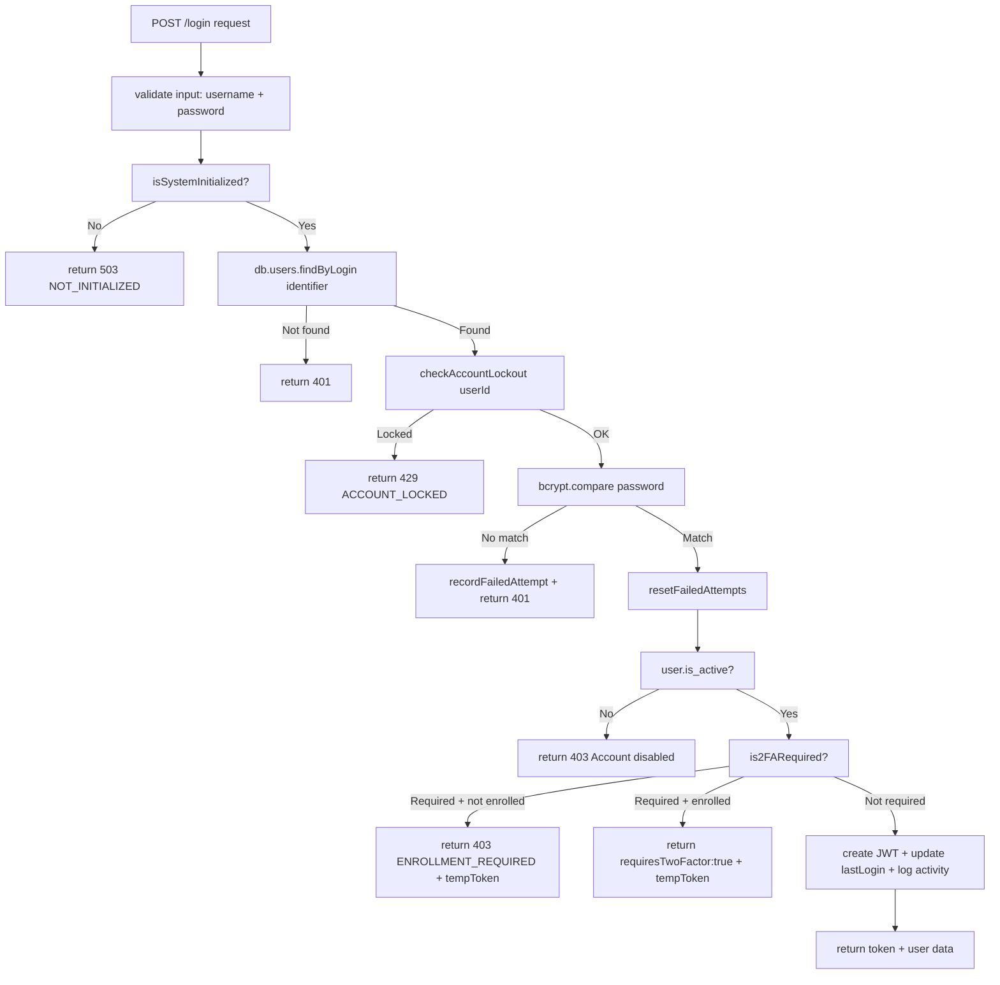

# Phase 2: Code Quality Hardening — Corrected Analysis & Fix Plan

**Date:** 2026-06-26  
**Status:** Plan ready for review  
**Previous Phase:** Security hardening (SSO error exposure + CSP refactoring) — **Completed**

---

## Investigation Summary

After thorough code investigation, **4 of the 10 original claims are false positives**, and **1 is already fixed**. Below is the corrected analysis.

| # | Severity | Original Claim | Actual Status | Action Required |
|---|----------|---------------|---------------|-----------------|
| C1 | High | Duplicate `authenticateToken` middleware in 4+ route files | **False Positive** — All 7 route files import from [`middleware/auth.js`](middleware/auth.js:171) shared module | Remove confusing re-export in [`routes/auth.js`](routes/auth.js:700) |
| C2 | High | Duplicate 2FA disable endpoint at 2fa.js:98 | **False Positive** — Only one `POST /disable` at [`2fa.js:93`](routes/2fa.js:93) | No action needed |
| C3 | High | Inconsistent 2FA key names | **Minor** — DB key `two_factor_enabled` is consistent; enforcement keys use mixed naming (`twofa-grace-period` vs `two_factor_` prefix) | Standardize enforcement key naming |
| C4 | High | Callback hell / deep nesting | **Verified** — [`routes/auth.js:322-522`](routes/auth.js:322) login endpoint has 7+ levels of nested callbacks | Refactor to async/await |
| C5 | Medium | 904 lines of CSS injected via JS | **Already Fixed** in Phase 2 — CSS extracted to [`styles/nav.css`](styles/nav.css) | No action needed |
| C6 | Medium | Duplicate 2FA reset endpoint | **Verified** — Two endpoints with different logic: [`routes/users.js:588`](routes/users.js:588) vs [`routes/2fa.js:380`](routes/2fa.js:380) | Consolidate into single implementation |
| C7 | Medium | Per-request theme enrollment (3 requests) | **Verified** — [`base.js:855-927`](base.js:855) sends 3 separate `fetch` calls | Batch into single request |
| C8 | Low | No pagination on user list | **False Positive** — [`routes/users.js:11-100`](routes/users.js:11) already supports `?page=1&limit=50` | No action needed |
| C9 | Low | Missing input validation on settings | **Verified** — [`routes/settings.js:193-248`](routes/settings.js:193) accepts arbitrary key-value pairs without type/schema validation | Add input validation middleware |
| C10 | Low | Mixed var/let/const usage | **False Positive** — 0 `var` declarations found in any `.js` or `.html` file | No action needed |

**Additional finding:** [`routes/auth.js:700-701`](routes/auth.js:700) re-exports `authenticateToken` and `authenticateFor2FAEnrollment` from the router module, creating a confusing import path. This should be removed.

---

## Valid Items Breakdown (6 items total)

### Item 1 (C1 mitigation): Remove confusing re-exports from [`routes/auth.js`](routes/auth.js:700)

**Problem:** Lines 700-701 export the imported middleware functions:
```javascript
module.exports = router;
module.exports.authenticateToken = authenticateToken;   // unnecessary
module.exports.authenticateFor2FAEnrollment = authenticateFor2FAEnrollment; // unnecessary
```

This allows importing auth middleware from `require('./routes/auth')` instead of `require('../middleware/auth')`, creating a confusing dual import path.

**Fix:** Remove lines 700-701 from [`routes/auth.js`](routes/auth.js:700).

**Verification:** After removal, search for any imports of `authenticateToken` from `routes/auth` — there should be none. All files use `require('../middleware/auth')`.

---

### Item 2 (C3): Standardize 2FA enforcement key names in [`routes/2fa.js`](routes/2fa.js) and [`routes/auth.js`](routes/auth.js)

**Problem:** Enforcement policy settings use inconsistent prefixes:
- `enforce-2fa-all-users` — kebab-case, descriptive
- `enforce-2fa-admins-only` — kebab-case, descriptive  
- `twofa-grace-period` — uses abbreviation `twofa` instead of `two_factor_`

The `twofa-grace-period` key should be `two-factor-grace-period` for consistency with the other enforcement keys.

**Impact:** Low. The key names are internal DB keys and only affect the code that reads/writes them. Changing them requires updating all references.

**Files affected:**
| File | Line(s) | Current Key | Change To |
|------|---------|-------------|-----------|
| [`routes/2fa.js`](routes/2fa.js:318) | 318 | `twofa-grace-period` | `two-factor-grace-period` |
| [`routes/auth.js`](routes/auth.js:34) | 34, 46 | `twofa-grace-period` | `two-factor-grace-period` |
| [`routes/settings.js`](routes/settings.js:685) | 685 | `twofa-grace-period` | `two-factor-grace-period` |

**Note:** This is a DB schema change. If there are existing rows in the `settings` table with key `twofa-grace-period`, they will not be migrated to the new key. A migration script or manual UPDATE is needed.

**⚠️ Decision needed:** Should the old key be migrated, or should this be treated as a "new installs only" change? Recommend adding a startup migration in [`server.js`](server.js) that renames the key if it exists.

---

### Item 3 (C4): Refactor [`routes/auth.js`](routes/auth.js:322) login callback hell to async/await

**Problem:** The login endpoint (`POST /login`, lines 322-522) uses 7+ levels of nested callbacks:
```
try → isSystemInitialized(cb) → global.db.get(cb) → checkAccountLockout(cb) → 
  bcrypt.compare(cb) → recordFailedAttempt(cb) / resetFailedAttempts(cb) → 
    is2FARequired(cb) → global.db.get(cb) → getSecuritySetting(cb) → res.json()
```

This makes the login flow extremely difficult to follow, debug, and maintain.

**Fix:** Refactor the nested callbacks to use the existing `async/await` pattern (the outer `try/catch` is already async). The helper functions that still use callbacks (`isSystemInitialized`, `checkAccountLockout`, `is2FARequired`, etc.) should be promisified or converted to async.

**Strategy:**
1. Create promisified wrappers for callback-based helpers:
   - `isSystemInitialized()` → returns `Promise<boolean>`
   - `checkAccountLockout(userId)` → returns `Promise<{isLocked, ...}>`
   - `is2FARequired(user)` → returns `Promise<{required, ...}>`
   - `getSecuritySetting(key, defaultValue)` → already partially promisified via `db.settings.getWithDefault`
   - The `global.db.get(...)` callbacks can be replaced with `db.get(...)` from the datalayer

2. Flatten the login handler into a linear async/await flow.

**Files affected:**
| File | Changes |
|------|---------|
| [`routes/auth.js`](routes/auth.js:1) | Refactor lines 22-29, 32-104, 107-121, 134-169, 172-176, 179-183, 186-202, 205-212 to return Promises; refactor lines 322-522 to linear async/await |

---

### Item 4 (C6): Consolidate duplicate 2FA reset endpoints

**Problem:** Two endpoints accomplish the same goal with different implementations:

| Aspect | [`routes/users.js:588`](routes/users.js:588) | [`routes/2fa.js:380`](routes/2fa.js:380) |
|--------|----------------------------------------------|-------------------------------------------|
| Route | `POST /api/users/:id/reset-2fa` | `POST /api/2fa/admin/reset/:userId` |
| Auth | `requireAdmin` middleware | Manual `req.user.role !== 'admin'` check |
| Keys deleted | `two_factor_enabled`, `two_factor_secret`, `two_factor_backup_codes`, `two_factor_enrollment_required` | `two_factor_secret`, `two_factor_backup_codes`, `two_factor_enabled` **(missing `_enrollment_required`)** |
| Notification | Security notification (severity: High) | Activity log only |

**Fix:**
1. De-duplicate by making one endpoint call the other's logic, or remove one entirely.
2. Ensure the surviving implementation:
   - Uses `requireAdmin` middleware consistently
   - Deletes all 4 keys (including `two_factor_enrollment_required`)
   - Sends a security notification for the audit trail
3. Update the corresponding admin UI to use the single surviving endpoint.

**Recommended approach:** Keep [`routes/2fa.js:380`](routes/2fa.js:380) as the canonical endpoint and add the missing key deletion + security notification. Remove or deprecate [`routes/users.js:588`](routes/users.js:588).

**Files affected:**
| File | Changes |
|------|---------|
| [`routes/2fa.js`](routes/2fa.js:380) | Add `'two_factor_enrollment_required'` to the delete keys array; add security notification |
| [`routes/users.js`](routes/users.js:588) | Remove the `/:id/reset-2fa` endpoint (lines 587-641) |
| [`settings.html`](settings.html:1) | Check if admin UI calls `/api/users/:id/reset-2fa`; update to `/api/2fa/admin/reset/:userId` if needed |

---

### Item 5 (C7): Batch 2FA enrollment API calls in [`base.js`](base.js:855)

**Problem:** The `enrollTwoFANavbar()` function sends 3 separate `fetch` requests to `/api/settings`:

```javascript
// Line 868 — sets two_factor_enabled
fetch('/api/settings', { method: 'PUT', body: {...} })
// Line 880 — sets two_factor_backup_codes
fetch('/api/settings', { method: 'PUT', body: {...} })
// Line 892 — sets two_factor_secret
fetch('/api/settings', { method: 'PUT', body: {...} })
```

Each request incurs HTTP overhead (headers, auth, round-trip). The [`PUT /api/settings`](routes/settings.js:193) endpoint supports batch updates via `{ settings: { key1: val1, key2: val2, ... } }`.

**Fix:** Merge the 3 requests into a single batch request:

```javascript
const requests = [
  fetch('/api/settings', {
    method: 'PUT',
    headers: { 'Content-Type': 'application/json', ... },
    body: JSON.stringify({
      settings: {
        two_factor_enabled: { value: 'true', category: 'security' },
        two_factor_backup_codes: { value: JSON.stringify(backupCodes), category: 'security' },
        two_factor_secret: { value: secret, category: 'security' }
      }
    })
  })
];
```

**Files affected:**
| File | Changes |
|------|---------|
| [`base.js`](base.js:855) | Replace 3 separate fetch calls with 1 batch PUT; update error handling |

---

### Item 6 (C9): Add input validation to settings API

**Problem:** The [`PUT /api/settings`](routes/settings.js:193) endpoint accepts arbitrary key-value pairs without validating types. A user could send:
- `session-timeout: "banana"` (should be a number)
- `enforce-2fa-all-users: "yes please"` (should be a boolean string)
- Arbitrary setting keys not in the allowed set

**Fix:** Add a schema validation layer that:
1. Defines an allowed settings keys list with expected types
2. Validates incoming values match the expected type
3. Rejects unknown keys (or warns and skips them)

**Recommended approach:** Use a simple schema object (no external dependency needed):

```javascript
const SETTINGS_SCHEMA = {
  'session-timeout': { type: 'number', min: 60, max: 86400, default: 3600 },
  'max-login-attempts': { type: 'number', min: 1, max: 100, default: 5 },
  'lockout-duration': { type: 'number', min: 1, max: 1440, default: 15 },
  'enforce-2fa-all-users': { type: 'boolean', default: false },
  'enforce-2fa-admins-only': { type: 'boolean', default: false },
  'two-factor-grace-period': { type: 'number', min: 0, max: 365, default: 7 }, // renamed per Item 2
  // ... etc.
};
```

Apply validation in [`routes/settings.js`](routes/settings.js:193) before saving.

**Files affected:**
| File | Changes |
|------|---------|
| [`routes/settings.js`](routes/settings.js:1) | Add `SETTINGS_SCHEMA` definition near line 12; add validation in PUT `/` handler (line 193) and POST `/` handler (line 305) |

---

## Execution Order

Recommended order of implementation (respects dependencies):

```
1. Item 1 (C1): Remove confusing re-exports from auth.js          [5 min]  — trivial
2. Item 5 (C7): Batch enrollment API calls in base.js             [15 min] — isolated client-side change
3. Item 4 (C6): Consolidate duplicate 2FA reset endpoints         [30 min] — requires checking UI references
4. Item 2 (C3): Standardize enforcement key names                 [20 min] — DB migration + code changes
5. Item 6 (C9): Add input validation to settings API              [45 min] — new schema + validation middleware
6. Item 3 (C4): Refactor auth.js login callback hell              [2-3 hrs] — largest refactor, requires careful testing
```

**Total estimated scope:** ~4-5 hours for experienced developer

---

## Risk Assessment

| Item | Risk | Mitigation |
|------|------|-----------|
| Item 1 | Low — removing exports that aren't imported elsewhere | Search the codebase first to confirm no external references |
| Item 2 | Medium — DB key rename could orphan existing data | Add startup migration script; test with existing DB |
| Item 3 | High — login flow is critical path; refactoring 200+ lines of callback-heavy code | Write tests first; test all login scenarios (2FA, lockout, SSO, enrollment) |
| Item 4 | Medium — removing an endpoint used by the admin UI | Search `.html` files for `reset-2fa` references; update UI |
| Item 5 | Low — client-side only; API already supports batch | Test with browser devtools to verify single network request |
| Item 6 | Medium — could reject previously valid (but wrong-type) settings | Log warnings instead of hard errors for unknown keys; coerce types gracefully |

---

## Mermaid Workflow: Login Refactor (Item 3 — Highest Complexity)



**Current state (callback hell):** Each box above is a nested callback, making the code read diagonally.

**Target state (async/await):** The flow above should read linearly, with each step awaiting the previous.

---

## Verification Checklist

After implementation, verify:

- [ ] Server starts without errors (`npm run dev`)
- [ ] Login flow works: normal login, 2FA login, 2FA enrollment, account lockout
- [ ] 2FA reset works from admin UI
- [ ] 2FA enrollment from navbar works (single network request)
- [ ] Settings API rejects invalid types gracefully
- [ ] Existing settings data with old key names is migrated
- [ ] No broken imports from removed exports in auth.js
