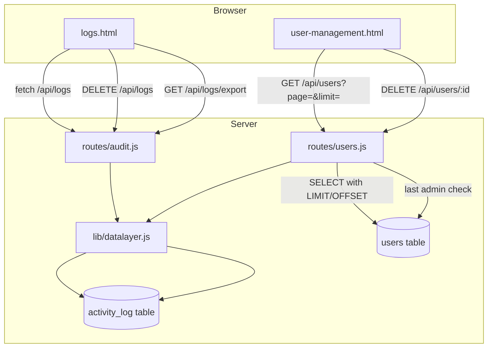
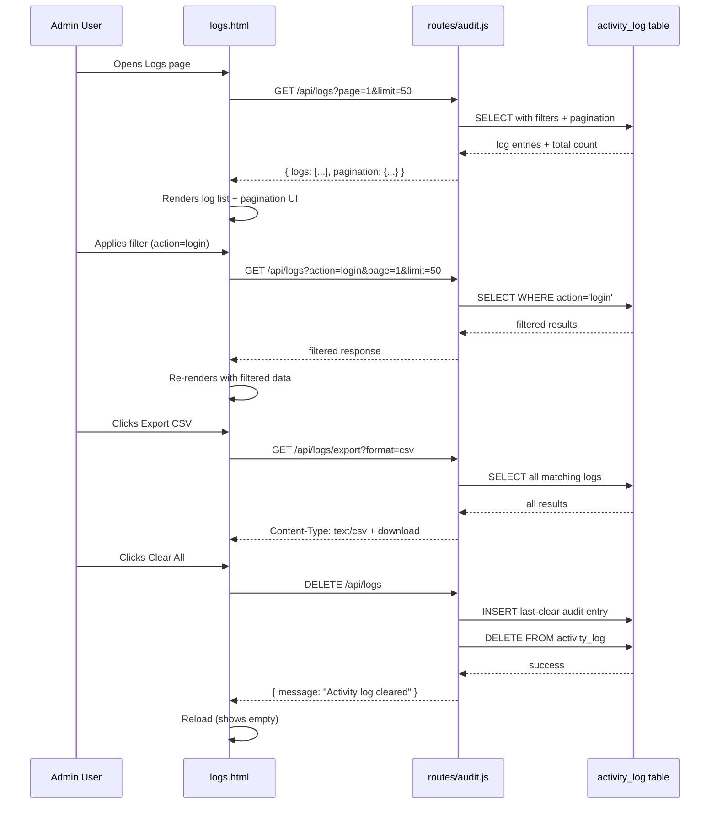

# Phase 3 — Audit & Observability Plan

## Current State Summary

| Aspect | Status | Details |
|--------|--------|---------|
| `logs.html` | ❌ Client-side only | Uses `localStorage.getItem('logs')` — completely disconnected from the server's `activity_log` database table |
| `lib/datalayer.js` — `activityLog` domain | ✅ Exists | Has `create()`, `getByUser()`, `getAll()` methods ready to use |
| `routes/auth.js` — audit logging | ✅ Uses datalayer | Already migrated to `db.activityLog.create()` |
| `routes/2fa.js` — audit logging | ✅ Uses datalayer | Already migrated to `db.activityLog.create()` |
| `routes/users.js` — audit logging | ❌ Raw `global.db.run()` | Still uses direct SQL INSERTs for activity logging |
| `routes/sso.js` — audit logging | ❌ Raw `global.db.run()` | Still uses direct SQL INSERTs for activity logging |
| `routes/users.js` GET / — pagination | ❌ None | Returns ALL users at once via `global.db.all()` |
| `routes/users.js` DELETE /:id — last admin guard | ❌ Missing | Can delete the last remaining admin account |
| `routes/users.js` — error response hardening | ⚠️ Partial | Some responses leak `err.message` to client |

---

## Work Items

### Item 1: Server-Side Activity Log API Endpoints

**Why:** The `activity_log` database table already stores audit data from login events, user CRUD, 2FA operations, and SSO logins. But there is no API to query it. The existing `logs.html` page uses localStorage only — it cannot see server-side audit data.

**Files to modify:**
- [`routes/users.js`](routes/users.js) — Add new routes or create a dedicated [`routes/audit.js`](routes/audit.js)

**Recommended approach:** Create [`routes/audit.js`](routes/audit.js) to keep the audit API separate from user management.

#### 1a — `GET /api/logs`

| Parameter | Type | Default | Description |
|-----------|------|---------|-------------|
| `page` | number | 1 | Page number (1-based) |
| `limit` | number | 50 | Results per page (max 200) |
| `user_id` | number | - | Filter by user ID |
| `action` | string | - | Filter by action type (`login`, `logout`, `create_user`, `delete_user`, `sso_login`, `2fa_reset`, etc.) |
| `date_from` | ISO string | - | Start date filter |
| `date_to` | ISO string | - | End date filter |
| `search` | string | - | Full-text search across `details` column |

**Response format:**
```json
{
  "logs": [
    {
      "id": 1,
      "user_id": 3,
      "username": "jdoe",
      "action": "login",
      "details": "User login from 192.168.1.100",
      "ip_address": "192.168.1.100",
      "user_agent": "Mozilla/5.0...",
      "timestamp": "2026-06-25T06:00:00.000Z"
    }
  ],
  "pagination": {
    "page": 1,
    "limit": 50,
    "total": 1250,
    "totalPages": 25
  }
}
```

**Implementation details:**
- Use the existing `db.activityLog.getAll()` as the base query
- Add a new method `db.activityLog.query(filters)` or build dynamic SQL in the route handler
- JOIN with `users` table to include `username` alongside `user_id`
- Require admin role (use existing `requireRole(['admin'])` middleware)

#### 1b — `DELETE /api/logs` (admin only)

- Clears the `activity_log` table (with confirmation mechanism)
- Logs the clear action itself before deleting (using a separate connection or writing to a log that survives the clear — simplest: log it before the DELETE)
- Response: `{ "message": "Activity log cleared successfully" }`

#### 1c — `GET /api/logs/export`

- Accepts same filter params as `GET /api/logs`
- Query param `format`: `json` (default) or `csv`
- For CSV: set `Content-Type: text/csv` and `Content-Disposition: attachment; filename="activity-log.csv"`
- For JSON: return full array as download

---

### Item 2: Rewrite `logs.html` to Use Server Data

**Why:** The current `logs.html` (1448 lines) stores logs in `localStorage` and renders them client-side. It cannot show server audit events. This rewrite preserves the existing UI/UX but replaces the data source.

**File to modify:** [`logs.html`](logs.html)

**Key changes:**

1. **Replace data source** — Remove all `localStorage.getItem('logs')` / `localStorage.setItem('logs')` references. Replace with `fetch('/api/logs?...')` calls.

2. **Keep existing UI structure:**
   - Filter sidebar (level, category, search) — adapt to server-side filtering
   - Statistics panel — fetch counts from server
   - Pagination controls — drive from server pagination response
   - Export (CSV/JSON) buttons — point to `/api/logs/export?format=...`
   - Clear All button — call `DELETE /api/logs` instead of clearing localStorage

3. **Adapt filtering:**
   - Level filter → `action` filter (map levels like "info", "warning", "error" to action categories)
   - Category filter → Map to action types (e.g., "auth" → "login", "logout"; "admin" → "create_user", "delete_user", etc.)
   - Search → `search` query param that searches `details` column
   - Date range → `date_from` / `date_to` query params

4. **Statistics:** Fetch from `GET /api/logs?page=1&limit=0` which returns total count, or add a dedicated stats endpoint.

5. **Pagination:** Use the server-provided `pagination.totalPages` and `pagination.total` instead of client-side math on the localStorage array.

---

### Item 3: Pagination for User List (`GET /api/users`)

**Why:** [`routes/users.js`](routes/users.js) line ~7 uses `global.db.all()` with no LIMIT/OFFSET, returning all users at once. For large deployments, this is inefficient.

**File to modify:** [`routes/users.js`](routes/users.js)

**Changes:**
1. Add query params: `page` (default 1), `limit` (default 50, max 200), `search` (optional, searches `name` and `email`)
2. Modify the SQL query to use `LIMIT ? OFFSET ?`
3. Run a separate `SELECT COUNT(*) FROM users` to get total count
4. Response format:
```json
{
  "users": [...],
  "pagination": {
    "page": 1,
    "limit": 50,
    "total": 42,
    "totalPages": 1
  }
}
```
5. **Note:** Check if any client code (e.g., `user-management.html`) relies on the old format (array of users directly) and update it if needed.

---

### Item 4: Last Admin Guard on User Deletion

**Why:** [`routes/users.js`](routes/users.js) `DELETE /:id` (line ~411) has no check to prevent deleting the only remaining admin account.

**File to modify:** [`routes/users.js`](routes/users.js)

**Changes:**
1. Before deleting, fetch the target user to check their role
2. If the target user has `role = 'admin'`, run `SELECT COUNT(*) FROM users WHERE role = 'admin'`
3. If count is 1 (the target user is the last admin), return `400 Bad Request`:
```json
{ "error": "Cannot delete the last admin account" }
```
4. Only proceed with deletion if count > 1 or the target is not an admin

---

### Item 5: Error Response Hardening in `routes/users.js`

**Why:** Some error responses in [`routes/users.js`](routes/users.js) include `err.message` in the response body, leaking internal state (e.g., line ~501: `details: err.message`).

**File to modify:** [`routes/users.js`](routes/users.js)

**Changes:**
1. Search for all `err.message` occurrences in response bodies
2. Replace with a generic message like `"Database error"` or `"An unexpected error occurred"`
3. Keep the full error logged server-side via `console.error()`
4. Specific locations to check: lines around 197–244 (user creation), lines 372–407 (user update), lines 411–454 (user deletion), lines 485–494 (onboarding check)

---

### Item 6 (Optional): Migrate `routes/users.js` and `routes/sso.js` to Datalayer for Activity Logging

**Why:** `routes/auth.js` and `routes/2fa.js` were migrated to use `db.activityLog.create()` in Phase 2. `routes/users.js` and `routes/sso.js` still use raw `global.db.run()` to insert into `activity_log`. This is a consistency and maintainability concern.

**Files to modify:**
- [`routes/users.js`](routes/users.js)
- [`routes/sso.js`](routes/sso.js)

**Changes:**
1. In `routes/users.js`, replace:
```javascript
global.db.run(
  'INSERT INTO activity_log (user_id, action, details, ip_address, user_agent) VALUES (?, ?, ?, ?, ?)',
  [req.user.id, 'create_user', `Created user: ${name} (${email})`, req.ip, req.get('User-Agent')]
);
```
With:
```javascript
const db = require('../lib/datalayer');
// ...
await db.activityLog.create(req.user.id, 'create_user', `Created user: ${name} (${email})`, req.ip, req.get('User-Agent'));
```

2. Same pattern for `update_user`, `delete_user`, `user_onboarding` actions in users.js and `sso_login`, `sso_signup` in sso.js

3. Since users.js uses callback-style `global.db.all/run`, may need to wrap the async `db.activityLog.create()` calls or convert those sections to async/await.

---

## Execution Order

| # | Item | Dependencies | Est. Complexity |
|---|------|-------------|-----------------|
| 1 | Create [`routes/audit.js`](routes/audit.js) with GET/DELETE/export endpoints | None | Medium |
| 2 | Rewrite [`logs.html`](logs.html) to use server API | Item 1 | High |
| 3 | Add pagination to [`routes/users.js`](routes/users.js) GET / | None | Medium |
| 4 | Add "last admin" guard to [`routes/users.js`](routes/users.js) DELETE /:id | None | Low |
| 5 | Harden error responses in [`routes/users.js`](routes/users.js) | None | Low |
| 6 | Migrate remaining routes to datalayer activity logging | None | Low |

Items 3, 4, 5, and 6 can be done in parallel. Item 2 depends on Item 1. Items 3–5 all modify `routes/users.js` so should be done in a single pass to minimize merge conflicts.

---

## Architecture Diagram



---

## Data Flow for Key Operations


