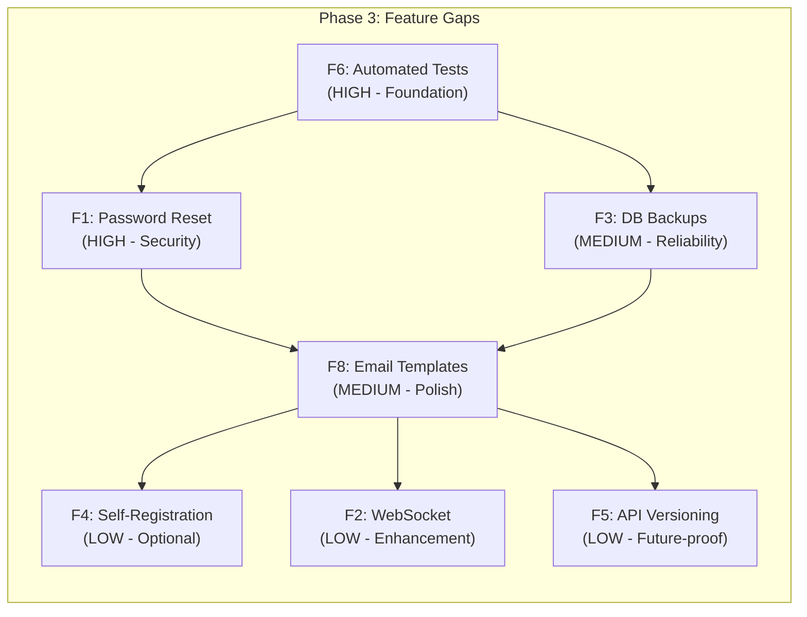

# Phase 3: Feature Gap Analysis & Implementation Plan

**Status**: Planning Complete
**Date**: 2026-06-26
**Based on**: `plans/landio-feature-assessment.md` — Feature Gaps table (F1-F10)

---

## Corrected Findings

The original assessment identified 10 feature gaps. After hands-on investigation of the codebase, **3 are false positives** and **7 are valid gaps** requiring implementation.

| # | Feature Gap | Verdict | Priority | Effort |
|---|-------------|---------|----------|--------|
| F1 | No password reset flow | ✅ **Valid gap** | **HIGH** | Medium |
| F2 | No WebSocket/real-time | ✅ **Valid gap** | **LOW** | Large |
| F3 | No automated DB backups | ✅ **Valid gap** | **MEDIUM** | Medium |
| F4 | No user self-registration | ✅ **Valid gap** | **LOW** | Small |
| F5 | No API versioning | ✅ **Valid gap** | **LOW** | Large |
| F6 | No automated tests | ✅ **Valid gap** | **HIGH** | Ongoing |
| F7 | No CI/CD pipeline | ❌ **FALSE POSITIVE** — `.github/workflows/ci.yml` exists (126 lines) | — | — |
| F8 | No email template system | ✅ **Valid gap** | **MEDIUM** | Medium |
| F9 | No health timeout handler | ❌ **FALSE POSITIVE** — `checkUrlReachable()` has proper `request.on('timeout')` at `routes/services.js:503-541` | — | — |
| F10 | No rate limiting on login | ❌ **FALSE POSITIVE** — `loginLimiter` (20/15min) at `routes/auth.js:10-17,312` | — | — |

**False positives to exclude** (no work needed):
- **F7**: CI/CD pipeline already exists — `.github/workflows/ci.yml` with test, code-quality, and build jobs on push/PR to main/develop
- **F9**: `checkUrlReachable()` already has a proper `request.on('timeout')` handler that destroys the request and rejects with `'Request timeout'`
- **F10**: `loginLimiter` rate limiter (20 requests per 15 minutes per IP) is already applied to the `/login` POST route

---

## Valid Feature Gaps (Implementation Order)

### F1 — Password Reset Flow (HIGH Priority)

**Current State**: `.env.example` declares `ENABLE_PASSWORD_RESET=true` but no implementation exists. The login page at [`login.html`](../login.html) has no "Forgot Password?" link. No password reset routes exist in [`routes/auth.js`](../routes/auth.js).

**Implementation Scope**:

1. **Backend — New route**: Add `POST /api/auth/forgot-password` in [`routes/auth.js`](../routes/auth.js)
   - Accept `email` in request body
   - Look up user by email
   - Generate a cryptographically secure reset token (e.g., `crypto.randomBytes(32).toString('hex')`)
   - Store token hash + expiry (e.g., 1 hour) in a new `password_resets` table or as a field on the user
   - Send email via existing `sendNotification('email', ...)` or `nodemailer` directly
   - Return 200 regardless of whether email exists (prevent user enumeration)

2. **Backend — New route**: Add `POST /api/auth/reset-password` in [`routes/auth.js`](../routes/auth.js)
   - Accept `token`, `newPassword` in request body
   - Validate token (check expiry, hash match)
   - Validate password against existing password policy (`validatePasswordPolicy()`)
   - Update user password, invalidate token
   - Return success response

3. **Database**: Add `password_resets` table via migration in [`server.js`](../server.js) `initializeDatabase()`:
   ```sql
   CREATE TABLE IF NOT EXISTS password_resets (
     id INTEGER PRIMARY KEY AUTOINCREMENT,
     user_id INTEGER NOT NULL,
     token_hash TEXT NOT NULL,
     expires_at INTEGER NOT NULL,
     used INTEGER DEFAULT 0,
     created_at TEXT DEFAULT (datetime('now')),
     FOREIGN KEY (user_id) REFERENCES users(id) ON DELETE CASCADE
   );
   ```

4. **Frontend — Login page**: Add "Forgot Password?" link to [`login.html`](../login.html) below the login form

5. **Frontend — New page**: Create `forgot-password.html` with email input form

6. **Frontend — New page**: Create `reset-password.html` with new password form (reads token from URL query param)

7. **Notification**: Ensure password reset emails use a clean template (leverage email template system from F8 if implemented first)

**Files to modify**:
- [`routes/auth.js`](../routes/auth.js) — Add forgot/reset routes
- [`server.js`](../server.js) — Add table initialization
- [`login.html`](../login.html) — Add "Forgot Password?" link
- (new) `forgot-password.html` — Email input form
- (new) `reset-password.html` — New password form
- (maybe) [`routes/notifications.js`](../routes/notifications.js) — Add email event type

**Risks**: SMTP must be configured for this to work. Need to handle the case where SMTP is not configured gracefully (return success but log a warning).

---

### F6 — Automated Tests (HIGH Priority)

**Current State**: Zero test files exist. No test framework in [`package.json`](../package.json). No test script in `package.json`.

**Implementation Scope**:

1. **Setup**: Install test dependencies:
   ```
   npm install --save-dev jest supertest
   ```

2. **Add npm scripts** to [`package.json`](../package.json):
   ```json
   "test": "jest",
   "test:watch": "jest --watch",
   "test:coverage": "jest --coverage"
   ```

3. **Create** `jest.config.js` at project root with:
   - `testEnvironment: 'node'`
   - `setupFilesAfterSetup: ['./tests/setup.js']`
   - `testMatch: ['**/tests/**/*.test.js']`

4. **Create** `tests/setup.js` — Test setup that:
   - Creates an in-memory SQLite database (or temp file)
   - Initializes all tables
   - Provides helper to create authenticated request (JWT token generation)
   - Provides seed data helpers

5. **Write tests** — Priority order:
   - `tests/auth.test.js` — Login, logout, token validation, password policy, account lockout
   - `tests/2fa.test.js` — Setup, verify, disable, backup codes
   - `tests/settings.test.js` — CRUD operations, validation schema, SMTP/Discord test
   - `tests/services.test.js` — CRUD, health check, auto-discover
   - `tests/users.test.js` — CRUD, admin operations
   - `tests/notifications.test.js` — Email/Discord content building

**Files to create/modify**:
- [`package.json`](../package.json) — Add devDependencies and scripts
- (new) `jest.config.js`
- (new) `tests/setup.js`
- (new) `tests/auth.test.js`
- (new) `tests/2fa.test.js`
- (new) `tests/settings.test.js`
- (new) `tests/services.test.js`
- (new) `tests/users.test.js`
- (new) `tests/notifications.test.js`

**Risks**: Database initialization in test setup needs to be isolated from production. The existing code uses `global.db` which must be mocked or replaced in tests.

---

### F3 — Automated Database Backups (MEDIUM Priority)

**Current State**: The `add-settings-table.js` seed data references `autoBackup` key but no backup logic exists anywhere.

**Implementation Scope**:

1. **Backup logic** — Create `lib/backup.js`:
   - Copy SQLite database file to backup directory
   - Use WAL checkpoint before backup for consistency
   - Compress backup (optional, using `zlib`)
   - Prune old backups (keep last N, configurable)
   - Log backup results to activity log

2. **Backup schedule** — Add to [`server.js`](../server.js):
   - Use `setInterval` or `node-cron` for scheduled backups
   - Check `settings` table for `autoBackup` and `backupInterval` keys
   - Default: disabled; if enabled, default interval: daily

3. **Settings** — Add backup settings to [`routes/settings.js`](../routes/settings.js) and [`settings.html`](../settings.html):
   - `autoBackup` (boolean toggle)
   - `backupInterval` (dropdown: daily, weekly, monthly)
   - `backupRetention` (number of backups to keep)
   - `backupPath` (custom path, defaults to `./backups/`)

4. **Manual backup** — Add `POST /api/backup` route for on-demand backup

5. **Health check** — Add backup status to system info endpoint

**Files to create/modify**:
- (new) `lib/backup.js` — Backup engine
- [`server.js`](../server.js) — Initialize backup scheduler
- [`routes/settings.js`](../routes/settings.js) — Add backup settings schema
- [`settings.html`](../settings.html) — Add backup settings UI
- [`routes/notifications.js`](../routes/notifications.js) — Add backup event type

**Risks**: Backups of an in-use SQLite database may be inconsistent without proper WAL checkpointing. Need to ensure backup directory is not web-accessible.

---

### F8 — Email Template System (MEDIUM Priority)

**Current State**: [`routes/notifications.js`](../routes/notifications.js), function `buildEmailContent()` (lines 237-366) uses inline HTML strings inside a `switch(event)` statement. No template engine, no partials, no theming.

**Implementation Scope**:

1. **Create template directory**: `templates/email/` with individual HTML files:
   - `templates/email/layout.html` — Base wrapper with header, body, footer
   - `templates/email/login.html` — Login alert
   - `templates/email/logout.html` — Logout alert
   - `templates/email/security.html` — Security alert
   - `templates/email/user-activity.html` — User activity alert
   - `templates/email/errors.html` — Error alert
   - `templates/email/app-start.html` — App start notification
   - `templates/email/app-stop.html` — App stop notification
   - `templates/email/backup.html` — Backup notification (for F3)
   - `templates/email/password-reset.html` — Password reset (for F1)

2. **Template engine**: Use simple string replacement (no external dependency) or integrate a lightweight engine like `ejs`:
   - Parse templates at startup (or lazily)
   - Cache parsed templates in memory
   - Use `{{variable}}` syntax for placeholders

3. **Refactor** [`routes/notifications.js`](../routes/notifications.js):
   - Create `loadTemplate(name, data)` function
   - Replace `buildEmailContent()` switch/case with template loading
   - Apply common layout wrapper automatically
   - Support inline CSS styling in templates

4. **Theming support** (optional): Allow templates to reference CSS variables or theme colors from settings

**Files to create/modify**:
- (new) `templates/email/layout.html`
- (new) `templates/email/login.html`
- (new) `templates/email/logout.html`
- (new) `templates/email/security.html`
- (new) `templates/email/user-activity.html`
- (new) `templates/email/errors.html`
- (new) `templates/email/app-start.html`
- (new) `templates/email/app-stop.html`
- [`routes/notifications.js`](../routes/notifications.js) — Refactor to use template engine

**Risks**: Template files need to be styled for email clients (inline CSS required). Need to maintain backward compatibility with existing event types and data shapes.

---

### F4 — User Self-Registration (LOW Priority)

**Current State**: No invite or registration endpoints exist. Users can only be created by admins via [`routes/users.js`](../routes/users.js) and the admin user management UI.

**Implementation Scope**:

1. **Backend** — Add `POST /api/auth/register` in [`routes/auth.js`](../routes/auth.js):
   - Check `settings` for `allowRegistration` (disabled by default)
   - Accept: `username`, `email`, `password`, `name`
   - Apply existing password policy
   - Create user with default role (e.g., `user`)
   - Optionally require email verification
   - Log registration to audit

2. **Backend** — Add `POST /api/auth/invite` in [`routes/users.js`](../routes/users.js):
   - Admin-only endpoint
   - Generate invite token + email to invitee
   - Track in `invites` table

3. **Database** — Add tables:
   ```sql
   CREATE TABLE IF NOT EXISTS invites (
     id INTEGER PRIMARY KEY AUTOINCREMENT,
     email TEXT NOT NULL,
     token_hash TEXT NOT NULL,
     role TEXT DEFAULT 'user',
     invited_by INTEGER NOT NULL,
     expires_at INTEGER NOT NULL,
     used INTEGER DEFAULT 0,
     created_at TEXT DEFAULT (datetime('now')),
     FOREIGN KEY (invited_by) REFERENCES users(id)
   );
   ```

4. **Settings** — Add registration toggle to [`settings.html`](../settings.html) Security tab:
   - `allowRegistration` (boolean)
   - `defaultRole` (dropdown: user, power_user)

5. **Frontend** — Add "Create Account" link to [`login.html`](../login.html) (only shown when registration is enabled)

6. **Frontend** — New `register.html` page with registration form

**Files to create/modify**:
- [`routes/auth.js`](../routes/auth.js) — Add register route
- [`routes/users.js`](../routes/users.js) — Add invite route
- [`server.js`](../server.js) — Add invites table
- [`login.html`](../login.html) — Add registration link
- (new) `register.html` — Registration form
- [`settings.html`](../settings.html) — Add registration toggle
- [`routes/settings.js`](../routes/settings.js) — Add registration settings schema

**Risks**: Spam/abuse prevention needed. Recommend adding rate limiting and optional email verification. Must not be enabled by default.

---

### F2 — WebSocket/Real-Time Updates (LOW Priority)

**Current State**: No Socket.IO or WebSocket code exists. The app is purely REST-based with polling for health checks.

**Implementation Scope**:

1. **Install**: `npm install socket.io`

2. **Server setup** — Integrate Socket.IO with existing HTTP server in [`server.js`](../server.js):
   - Attach Socket.IO to existing `http.createServer(app)`
   - Configure CORS to match existing settings
   - Authenticate connections via JWT token in handshake

3. **Event channels**:
   - `service:status` — Push health check status changes
   - `user:update` — Push user profile/role changes to relevant clients
   - `notification` — Push in-app notifications
   - `system:alert` — Push system alerts (backup status, errors)

4. **Service health check integration** — Modify [`routes/services.js`](../routes/services.js) health check loop:
   - After each health check completes, emit `service:status` event
   - Only emit on status change (reduce noise)

5. **Client setup** — Add Socket.IO client to [`base.js`](../base.js):
   - Connect on page load after auth
   - Reconnect on disconnect
   - Handle events to update UI (service cards, notification badges)

**Files to create/modify**:
- [`server.js`](../server.js) — Integrate Socket.IO
- [`routes/services.js`](../routes/services.js) — Emit status changes
- [`base.js`](../base.js) — Connect and handle events
- [`dashboard.html`](../dashboard.html) — Real-time service card updates
- [`settings.html`](../settings.html) — Real-time notification

**Risks**: Socket.IO adds ~50KB to client bundle. May not work with some reverse proxy configurations (needs sticky sessions or WebSocket passthrough). Authentication via handshake adds complexity.

---

### F5 — API Versioning (LOW Priority)

**Current State**: All routes are at `/api/*` with no version prefix (e.g., `/api/auth/login` instead of `/api/v1/auth/login`).

**Implementation Scope**:

1. **Route restructuring** — Move all current routes under `/api/v1/`:
   - [`routes/auth.js`](../routes/auth.js): `/api/auth/*` → `/api/v1/auth/*`
   - [`routes/2fa.js`](../routes/2fa.js): `/api/2fa/*` → `/api/v1/2fa/*`
   - [`routes/users.js`](../routes/users.js): `/api/users/*` → `/api/v1/users/*`
   - [`routes/services.js`](../routes/services.js): `/api/services/*` → `/api/v1/services/*`
   - [`routes/settings.js`](../routes/settings.js): `/api/settings/*` → `/api/v1/settings/*`
   - [`routes/audit.js`](../routes/audit.js): `/api/logs/*` → `/api/v1/logs/*`
   - [`routes/sso.js`](../routes/sso.js): `/api/sso/*` → `/api/v1/sso/*`
   - [`routes/notifications.js`](../routes/notifications.js): `/api/notifications/*` → `/api/v1/notifications/*`

2. **Legacy redirects** — Add middleware in [`server.js`](../server.js) to redirect `/api/*` → `/api/v1/*`:
   ```javascript
   app.use('/api', (req, res, next) => {
     if (!req.path.startsWith('/v1/')) {
       // 301 redirect or proxy to v1
       return res.redirect(301, `/api/v1${req.path}`);
     }
     next();
   });
   ```

3. **Client update** — Update all fetch calls in frontend files:
   - [`base.js`](../base.js)
   - [`login.html`](../login.html) inline scripts
   - [`settings.html`](../settings.html) inline scripts
   - [`user-management.html`](../user-management.html) inline scripts
   - [`manage-services.html`](../manage-services.html) inline scripts
   - [`logs.html`](../logs.html) inline scripts
   - [`dashboard.html`](../dashboard.html) inline scripts

4. **Version header** — Add `X-API-Version: v1` response header via middleware

**Files to modify**: All route files + all frontend files with fetch calls.

**Risks**: High-touch change affecting every API call in the application. Requires thorough testing. May break integrations (SSO callbacks, external tools). Recommend deferring until after tests (F6) are in place.

---

## Execution Order (Recommended)



### Recommended implementation order:

1. **F6 — Automated Tests** (HIGH)
   - Foundation for all other changes
   - Ensures existing functionality won't break
   - Critical before any route refactoring

2. **F1 — Password Reset Flow** (HIGH)
   - Security-critical feature
   - `.env.example` already declares support
   - Simple, self-contained implementation

3. **F3 — Automated DB Backups** (MEDIUM)
   - Data protection
   - Relatively isolated change

4. **F8 — Email Template System** (MEDIUM)
   - Dependency for F1 (password reset email), F3 (backup notification)
   - Should be implemented after F1 and F3 to avoid rework

5. **F4 — User Self-Registration** (LOW)
   - Simple toggle-based feature
   - Depends on email templates for verification emails

6. **F2 — WebSocket/Real-Time** (LOW)
   - Enhancement, not critical
   - Benefits from tests being in place

7. **F5 — API Versioning** (LOW)
   - Largest surface area change
   - Defer until all other features stable
   - Requires tests first (F6)

---

## Discrepancies from Original Assessment

The following findings in the original assessment at [`plans/landio-feature-assessment.md`](../plans/landio-feature-assessment.md) were **incorrect** and should be noted:

1. **Page 764-765, F7 "No CI/CD Pipeline"**: The assessment claimed ".github/ directory exists but currently contains no workflow files." **This is incorrect.** `.github/workflows/ci.yml` contains 126 lines with `test`, `code-quality`, and `build` jobs running on push/PR to `main`/`develop` branches with Node.js 14.x, 16.x, and 18.x matrix.

2. **Page 765, F9 "Missing Proper Timeout Handler in Some Code Paths"**: The assessment claimed "health check doesn't have proper timeout handling." **This is largely incorrect.** The main health check function `checkUrlReachable()` at `routes/services.js:503-541` already has a `request.on('timeout')` handler that calls `request.destroy()` and rejects with `'Request timeout'`. The timeout is configurable per-service via the `health_check_timeout` setting stored in the database.

3. **Page 765, F10 "No Rate Limiting on Authentication Endpoints"**: The assessment claimed "no rate limiting on auth endpoints." **This is incorrect.** `loginLimiter` (20 requests per 15 minutes per IP) is defined at `routes/auth.js:10-17` and applied at `routes/auth.js:312` on `router.post('/login', loginLimiter, ...)`. The `server.js` also has general, static, and API rate limiters.
